## Lab 3 continued: Batch Processing Flow Accumulation Models

This section took the processes learned in lab three and converted them into batch processes. 

We used SAGA version 6.2, inputting data from ASTER and SRTM. The ASTER data is Model V003, 2019, while the SRTM data is from NASA's Shuttle Radar Teopography Mission Global 1 arc second data set.

For the region as a whole, the SRTM data provides a mask for waterfeatures while ASTER does not. Furthermore, the channel networks rendered more completely for the SRTM data than the ASTER data and also appear to more closely fit where streams would be on an elevation model and Google imagery via an eye-check. Additionally, the ASTER Number file has large sections that are drawn from the SRTM data.

ASTER Elevation and Data Sources

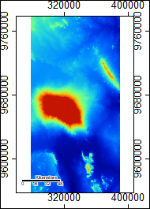
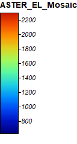

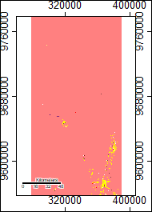
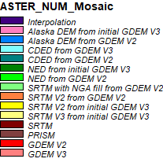

SRTM Elevation and Data Sources

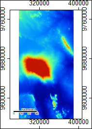
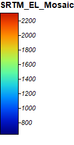

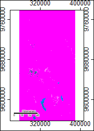
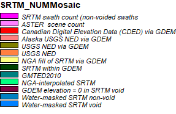

Batch Process Download

[Batch File](mosaic_utmproj.bat)

Bath Process Screen Capture

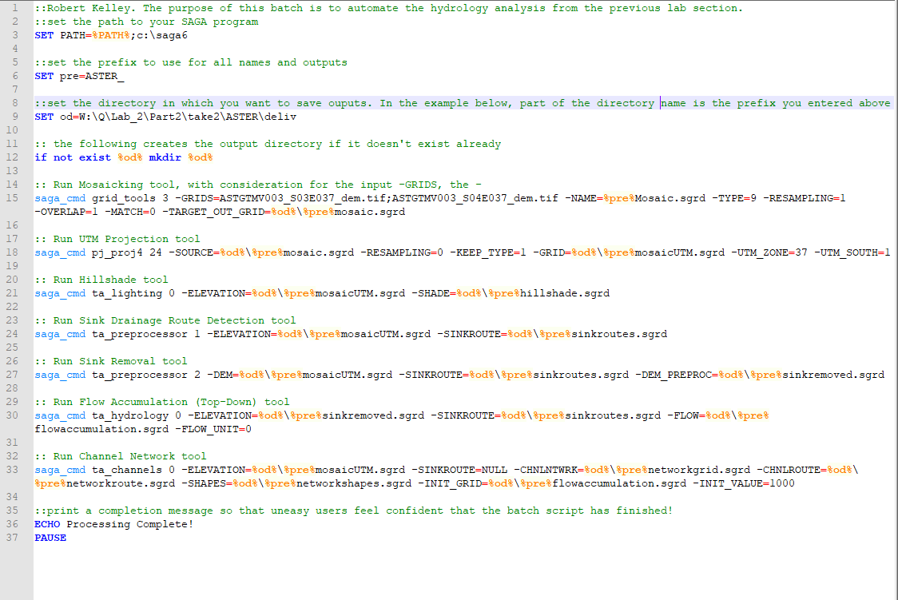

The batch process is a collection of commands written out in the computer's command window. Instead of needing to go through the UI of SAGA or GQIS, batch processing runs those programs for you directly. Each tool I used to model the hydrology was found [here](http://www.saga-gis.org/saga_tool_doc/6.4.0/a2z.html). Most of my settings remained on default, but later on in the processes some changed. Running the processes one time took roughly twenty minutes, but it was possible to run different batches on several computers to preserve time.

Difference in Elevation

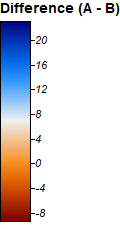

Flow Accumulation initial image

The image below is what SAGA initially put out as the difference between the flow accumulations from the different data sets. The information was there, but not in workable form.

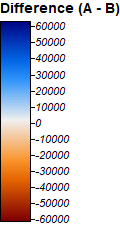

Flow Accumulation Difference with Contrast

Creating contrast between the two networks was the first step.

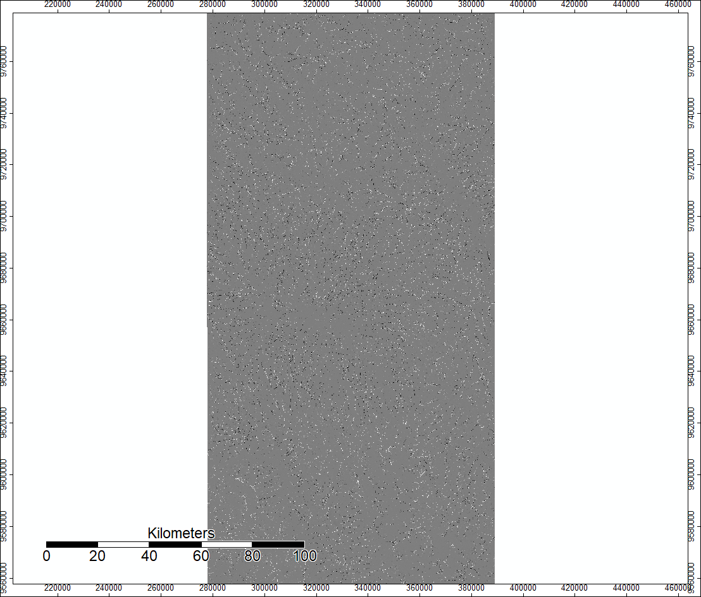
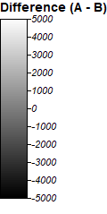

This is a closeup of the product of the step prior, allowing viewers to see how the flows are very similar and have many of the same movements, but at the ground level are often slightly different.

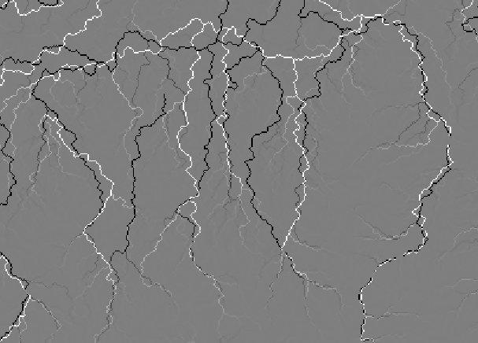

SRTM Hillshade

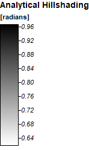

ASTER Hillshade

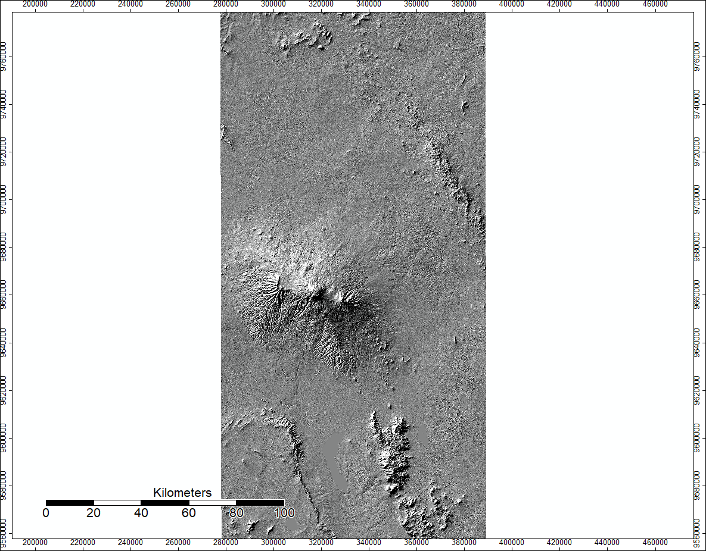
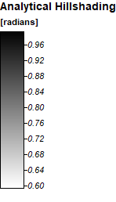

3D Renderings of the channel networks over the hillshade

ASTER

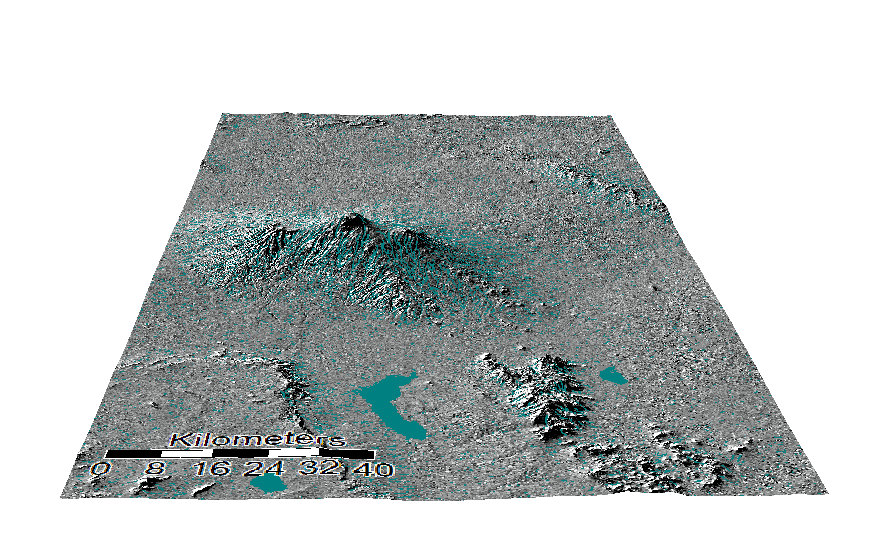

SRTM

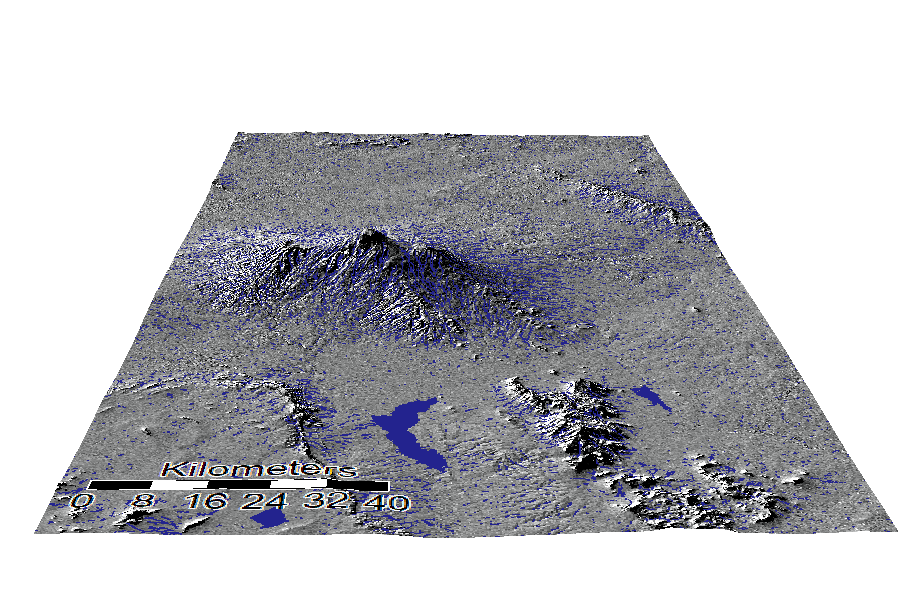

One thing to note between the two different types of data is the water feature in the bottom right hand corner- it is different. SRTM provides a void for known water there, which is more likely to be correct than the ASTER results.

Google Satelite Basemap

While there were errors with this in QGIS, Ben Dohan and Koufre found a good workaround inside of QGIS resulting in the same idea.

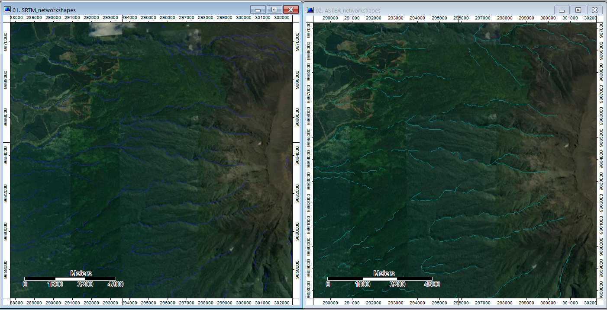

One issue is that at higher elevations, the channel networks never seem to leave the ridges of the mountain. This is most likely a result of using a top-down flow accumulation processs, where the starting point was not able to sample widely enough to break out of issues like that. In this case, it would be important to sample from the bottom-upwards as well, and then average the two to minimize this error.

SRTM Error1

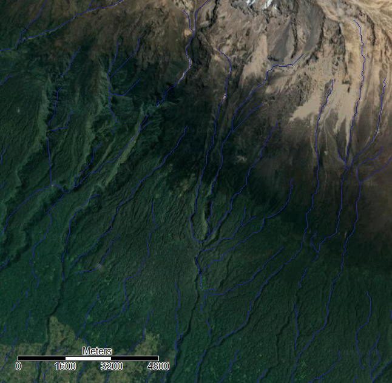

Here, there are examples of the flows mainly following what one would expect from the imagery, but every so often they jump their tracks and go off in an unexpected direction. This seems most likely to be the result of my unit size and sampling method, either having units too broad or too specific to notice the smallest details- or to over react to them. My guess is the former.

SRTM Error2

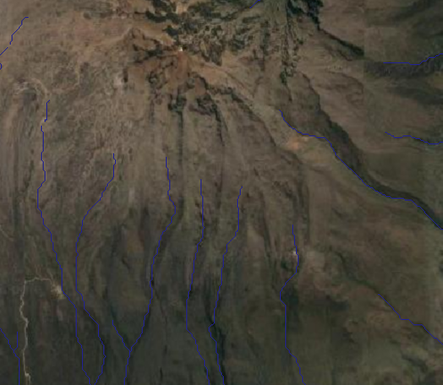

These are examples of where there is what seems like a steep section of the mountain but little differences in terrain to guide it. One likely explanation is that the flow accululation is based on higher levels of snow and ice at the summit, which is not present in the arial photography. That exposes an underlying issue with these data sets which we have discussed in class. Because space very often can change over time, having a data set that does not match up squarely with the time frame of other parts of your analysis can create some disjointedness.

[Click here to go to Hydrology; Lab 3](saga.md)

[Click here to go to the main page](index.md)
