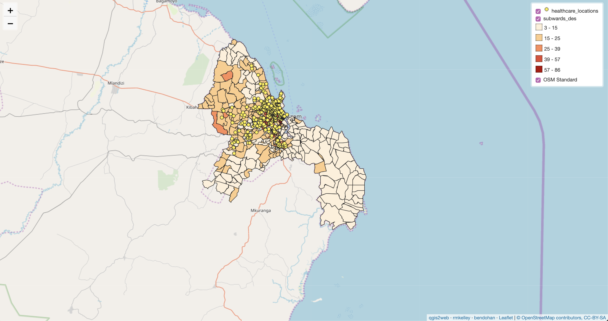

## Dar es Salaam

Click [here](index.md) to return to my homepage.

The purpose of this lab was to use skills in SQL and database management to run vulnerability analyses on open street map data of Dar es Salaam. World Bank investment in the area and the mapping efforts of [Ramani Huria](https://ramanihuria.org/about-us/) have led to Dar es Salaam being one of the most mapped areas on Open Streetmap. Working with Ben Dohan and inspired by the missions of [Resilience Academy](https://resilienceacademy.ac.tz/) and Ramani Huria, we wanted to explore using opensource software and data to make conduct meaningful analysis that remains replicable. Our work focused on writing scripts and using data that could be accessible to anyone, anywhere. The same goes for our results, which we made into an online leaflet map.

The question that we chose to illustrate was the relationship between road access and housing accross the city. Road access is increadibly important for rapid transit which is in-turn an important part of emergancy services. In critical, a few extra minutes for an ambulance trip can be a tipping point (or a burnt down neighborhood, although fire services were not the focus of our work). Our research question involved determining road networks throughout Dar es Salaam, which is a proxy for emergecny vehicle access and connectivity. Why this is not a clear-cut and easily answerable question is because of how road

To access the final product, follow the link below. To return, click the link "rmkelley" in the bottom right of the map.
[Leaflet map of road access to hospitals in Dar es Salaam](qgis2web_2019_12_05-15_55_46_601626/index.html)



To download our SQL code to understand our exact queries, click on the link below.
[sql code](DeScode.sql)

General notes to anyone attempting analysis with large amounts of features.

-Make sure that your data formats fit whatever you are trying to do to them. For example, we had a situation where we wanted to determine the width of the streets, but the column was a string. We had to remove text, remove nulls, and only then could we convert it into float. The CAST function is useful for converting data types. We used CAST to take string data in one column and then CAST it into the float type in another column that we made.
  
-Make sure that your datasets are not too large to run analysis on. We wanted to upload all the road files into leaflet, but it would not upload them because it was too large. That prompted us to rethink what exactly we wanted to show in our analysis. One tip for when you're running spatial analysis is to index the geometries. It means that your computer will not have to go through every single entry to find what it is looking for and instead will conduct a spatially refined and much quicker search.

-ALWAYS visually check your results. If something does not look right, it probably isn't. We had a point where half of our major roads were going to be missing from the buffer, because we were not inclusive enough in our selection process. It was an easy fix, but if we had not caught it then half of Dar es Salaam would seem to have no access to anywhere.

## Our steps:

Before beginning our analysis, we had to upload the OSM data into our PostGIS server. We used a [batch script](convertOSM.bat), the generic text of which is below along with an explination of the commands:

:: command to import smallmap.osm into testDSM postgis database on artemis, by Joseph Holler

K:\gg323\osm2pgsql\osm2pgsql -H 140.233.36.33 -P 5432 -d database_name -U user_name -S dsm.style -W -l -v -x K:\gg323\dsm_osm.osm

pause

:: K:\gg323\osm2pgsql\osm2pgsql is the location of hte osm2pgsql program on Splinter. If you save the program somewhere else, change this address

:: -H 140.233.36.33 is the IP address for the PostGIS server, artemis. you can determine ip addresses of named network locations with a ping command, e.g. PING ARTEMIS

:: -P 5432 is the port for connecting to the database

:: -d database_name is the name of a database.  Change database_name to your own database name!

:: -U user_name is your user name. Change to your own user name!

:: -S dsm.style is a link to a style file. This assumes the style file is named dsm.style and saved in the same location as this batch script. If you move/rename the style file, change this link accordingly.

:: -W creates a password prompt, for connecting to your database

:: -l stores the data in wgs 1984 latitude,longitude, rather than pseudo mercator

:: -v verbose output, giving more information in the command prompt

:: -x creates extra attributes columns for the user name, user ID, time stamp... and I have added these extra entries into the dsm.style file.

:: K:\gg323\dsm_osm.osm the name of an OpenStreetMap file with data from the Dar es Salaam region, stored on Splinter so that we do not all have to download and copy this 1.5 gb file. You may download your own openstreetmap files from www.openstreetmap.org, and just add the .osm extension to any openstreetmap file you download. Alter the folder path and file name  if you move or rename the .osm file.

:: if you modify this, the tags are case-sensitive!

:: I attempted to use a -E tag to customize the projection to UTM zone 36 south 

### 1. Figure out what we were interested in, and then determine what data we needed. 

Can the question be simplified? In our case, road access to hospitals.

### 2. We had to simplify and clean the data pulled from OSM. 

We made three datasets: hospitals, houses, and roads. Roads had to have a width and a road distinction in the "highway" column. Homes had to have the Amenity column be "residential" and hospital had to be hospital or doctor.

```sql
update planet_osm_line set width = replace(width, 'O', '0');

update planet_osm_line set width = trim(width, ' Mmetrs');

ALTER TABLE planet_osm_line ADD COLUMN nwidth float;

UPDATE planet_osm_line SET nwidth = CAST(width AS float) WHERE highway IS NOT NULL;

create table st_transform(geom, "4326")::geometry("4326", 'multipolygon') home as
SELECT building, amenity FROM planet_osm_polygon WHERE building = 'yes' AND amenity IS NULL OR building = 'residential';

select populate_geometry_columns();

UPDATE planet_osm_line SET nwidth = 0 WHERE highway IS NOT NULL AND nwidth is null;

ALTER TABLE planet_osm_line ADD COLUMN distinction integer;

UPDATE planet_osm_line SET distinction = 1 WHERE highway = 'trunk' or highway = 'trunk_link' or highway = 'primary' or highway = 'primary_link';

UPDATE planet_osm_line SET distinction = 0 WHERE  highway = 'yes'  OR highway =  'unclassified' OR  highway  =  'bridleway' 
OR  highway = 'construction' OR  highway = 'cycleway' OR highway = 'footway' OR  highway = 'path' OR highway = 'pedestrian' 
OR highway = 'residential' Or highway=  'road'  OR highway = 'secondary' OR highway = 'secondary_link' OR  highway = 'service' 
OR  highway = 'steps' OR highway = 'tertiary' Or highway = 'tertiary_link' OR highway = 'track'; 
```

### 3. Create a buffer around the roads to give area. 

The roads were originally lines with width not represented. We tested multiple different buffers, adding 5 meters for most roads and 18 meters for the trunk roads to encapsulate the road width and the building setbacks.

```sql
CREATE TABLE buffer7 as
SELECT nwidth, distinction

CASE
WHEN distinction = 1 then ST_Buffer(Geography(way), 18+nwidth/2, 'endcap=round')
when distinction = 0 then ST_Buffer(Geography(way), 5+nwidth/2, 'endcap=round')
end  as link

FROM planet_osm_line 
WHERE highway is not null;

ALTER table home ADD COLUMN linkage float;

update buffer7 set geom = link::geometry('polygon', 4326);
```

### 4. Intersect the building layer with the buffer. 

How many houses are actually in proximity to the road? The buffer was our proxy for ease of access. If your residence is set too far back from a road, it is unlikely to have easy or official access. Especially for medical personnel in an informal settlement. 

```sql
UPDATE home set linkage = distinction FROM buffer7 WHERE st_intersects(way, geom);

ALTER table home ADD COLUMN subward integer;

UPDATE home
SET subward = fid
FROM subwardra
WHERE ST_Intersects(way, ST_makeValid(geom)) ;

ALTER table home add column access integer;

create table acc as 
 select subward, count(access) as acY from home
 WHERE access = 1
 group by subward;
 
 create table total as 
 select subward, count(access) as acY from home
 group by subward;
```

### 5. Once we determined intersection, we had to get that data into a subwards feature. 

We made a table that took data from homes and subwards, and then took the agglomerated data from that and added it into our subwards feature.

```sql
update subwardra 
set allhomes2 = acT FROM acc WHERE acc.subward = subwardra.fid;

alter table subwardra add column sherlockhomes2 float;

update subwardra 
set sherlockhomes2 = acY FROM total WHERE total.subward = subwardra.fid;

alter table home add column pctaccess float;

update subwardra
set pctaccess = (sherlockhomes/allhomes *100);

create table health as
SELECT building, amenity, way FROM planet_osm_polygon
where building = 'hospital' or amenity = 'hospital' or amenity = 'doctors' or building = 'doctors'
```
