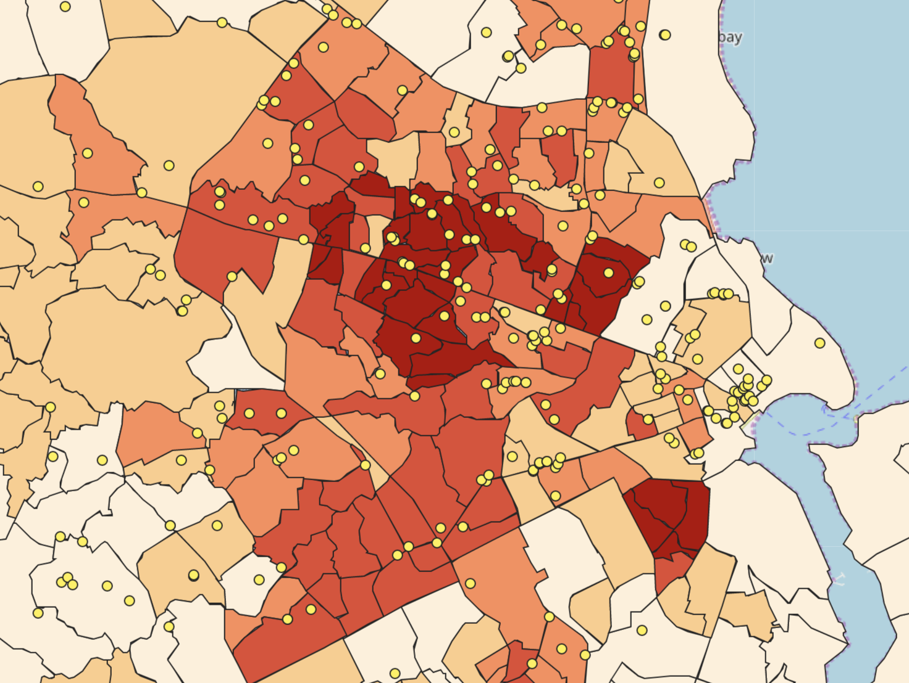

## Dar es Salaam

Click [here](index.md) to return to my homepage.

The purpose of this lab was to use skills in SQL and database management to run vulnerability analyses on open street map data of Dar es Salaam. World Bank investment in the area and the mapping efforts of [Ramani Huria](https://ramanihuria.org/about-us/) (from whom we aquired the subward layers for QGIS) have led to Dar es Salaam being one of the most mapped areas on [OpenStreetMap](https://www.openstreetmap.org). Working with Ben Dohan and inspired by the missions of [Resilience Academy](https://resilienceacademy.ac.tz/) and Ramani Huria, we wanted to explore using opensource software and data to conduct meaningful analysis while remaining replicable. Our work focused on writing scripts and using data that could be accessible to anyone, anywhere. The same goes for our results, which we made into an online leaflet map.

We chose to illustrate  the relationship between road access and housing accross the city. Road access is increadibly important for rapid transit which is in-turn an important part of emergancy services. In critical, a few extra minutes for an ambulance trip can be a tipping point (or a burnt down neighborhood, although fire services were not the focus of our work). Our research question involved determining road networks throughout Dar es Salaam, which is a proxy for emergecny vehicle access and connectivity. Why this is not a clear-cut and easily answerable question is because of how road networks are recorded in OSM, along with the variability in building and planning processes (if there are any) in informal settlement areas.

To access the final product, follow the link below. To return, click the link "rmkelley" in the bottom right of the map.
[Leaflet map of road access to hospitals in Dar es Salaam](qgis2web_2019_12_05-15_55_46_601626/index.html)


To download our SQL code to understand our exact queries, click on the link below.

[sql code](DeScode.sql)

## Data

Professor Holler predownloaded the nodes of Dar es Salaam, which came in several different layers. We chose to use the lines, polygons, and points layers to eventually to the Ramani Huria subward files. Within those, we used lines to extract the road data (the roads file did not have all the data that we needed, and we were able to extract the roads from the lines file off of the 'highway' attribute. The homes were pulled from the polygon layer, which in the case of Dar es Salaam is generally accurate because of the data collection work that the World Bank and other organizations have done in the area. We used points for the hospital layer because while their true shapes were not important, their location was, and the points were able to be more clearly represented cartographically than polygons were.

## General notes to anyone attempting analysis with large amounts of features.

-Make sure that your data formats fit whatever you are trying to do to them. For example, we had a situation where we wanted to determine the width of the streets, but the column was a string. We had to remove text, remove nulls, and only then could we convert it into float. The CAST function is useful for converting data types. We used CAST to take string data in one column and then CAST it into the float type in another column that we made.
  
-Make sure that your datasets are not too large to run analysis on. We wanted to upload all the road files into leaflet, but it would not upload them because it was too large. That prompted us to rethink what exactly we wanted to show in our analysis. One tip for when you're running spatial analysis is to index the geometries. It means that your computer will not have to go through every single entry to find what it is looking for and instead will conduct a spatially refined and much quicker search.

-ALWAYS visually check your results. If something does not look right, it probably isn't. We had a point where half of our major roads were going to be missing from the buffer, because we were not inclusive enough in our selection process. It was an easy fix, but if we had not caught it then half of Dar es Salaam would seem to have no access to anywhere.


## The results

The image below gets darker as a higher percent of residences in a subward have access to roads. The downtown, which is near the bay, has the highest concentration of medical facilities but also- and this is not shown in our map- has a low concentration of residences. In reality, our map shows both access and the density of housing in an area. The informal areas are relatively well connected via smaller roads. We set a 5-foot buffer for minor roads because those could at least allow for medical personal to get through, and many were larger and would actually be able to accept an ambulance. If you look closely at our map, many of the facilities correspond with borders, which also happen to often be major roads which have increased access to cars and emergency vehicles. We were not able to include roads in our map because of how large the file was, however. The image above also shows how health services are clustered towards the center of the city, although I am inclined to believe that is a data shortcoming, as opposed to such a wide swath of the citybeing void of any health services.



## Conclusion

This lab showed me both the possibilities of open source software and data, but also many of the challenges and limitations that come with it. Data sources like OpenStreetMap are an increadibly useful way to source and share information, but also have a level of variability that official datasets often do not. That is the price of having everyone be an equal player in how information is written and shared. But, it means that anyone could look at my code and decide to see if it still works in Dar es Salaam (it will) or take it to any other city. Aside from the subwards layer, all this work is replicable in other geographies. The tags may change, but that is an aspect of open streetmap that half an hour of research should be able to figure out and correct for.

I happened to be interested in transportation and health, but the data in OpenStreetMap has a myriad of possibilities. Other members of my class analyzed topics from wetlands to informal settlements and more. Head over [here](GIS4DEV.github.io/index.md) to see them if you are interested. 

## Our steps:

Before beginning our analysis, we had to upload the OSM data into our PostGIS server. We used a [batch script](convertOSM.bat), the generic text of which is below along with an explination of the commands:

:: command to import smallmap.osm into testDSM postgis database on artemis, by Joseph Holler

K:\gg323\osm2pgsql\osm2pgsql -H 140.233.36.33 -P 5432 -d database_name -U user_name -S dsm.style -W -l -v -x K:\gg323\dsm_osm.osm

pause

:: K:\gg323\osm2pgsql\osm2pgsql is the location of hte osm2pgsql program on Splinter. If you save the program somewhere else, change this address

:: -H 140.233.36.33 is the IP address for the PostGIS server, artemis. you can determine ip addresses of named network locations with a ping command, e.g. PING ARTEMIS

:: -P 5432 is the port for connecting to the database

:: -d database_name is the name of a database.  Change database_name to your own database name!

:: -U user_name is your user name. Change to your own user name!

:: -S dsm.style is a link to a style file. This assumes the style file is named dsm.style and saved in the same location as this batch script. If you move/rename the style file, change this link accordingly.

:: -W creates a password prompt, for connecting to your database

:: -l stores the data in wgs 1984 latitude,longitude, rather than pseudo mercator

:: -v verbose output, giving more information in the command prompt

:: -x creates extra attributes columns for the user name, user ID, time stamp... and I have added these extra entries into the dsm.style file.

:: K:\gg323\dsm_osm.osm the name of an OpenStreetMap file with data from the Dar es Salaam region, stored on Splinter so that we do not all have to download and copy this 1.5 gb file. You may download your own openstreetmap files from www.openstreetmap.org, and just add the .osm extension to any openstreetmap file you download. Alter the folder path and file name  if you move or rename the .osm file.

:: if you modify this, the tags are case-sensitive!

:: I attempted to use a -E tag to customize the projection to UTM zone 36 south 

### 1. Figure out what we were interested in, and then determine what data we needed. 

Can the question be simplified? In our case, road access to hospitals.

### 2. We had to simplify and clean the data pulled from OSM. 

We made three datasets: hospitals, houses, and roads. Roads had to have a width and a road distinction in the "highway" column. Homes had to have the Amenity column be "residential" and hospital had to be hospital or doctor.

```sql
update planet_osm_line set width = replace(width, 'O', '0');
--This replaces incorrectly entered text with a 0.--
update planet_osm_line set width = trim(width, ' Mmetrs');
--This trims everyhing in the column width after any part of 'Mmetrs' appears.
ALTER TABLE planet_osm_line ADD COLUMN nwidth float;
--This adds a the column nwidth.--
UPDATE planet_osm_line SET nwidth = CAST(width AS float) WHERE highway IS NOT NULL;
--This sets that column equal to width where highway has a value.--
create table st_transform(geom, "4326")::geometry("4326", 'multipolygon') home as
SELECT building, amenity FROM planet_osm_polygon WHERE building = 'yes' AND amenity IS NULL OR building = 'residential';
--This names a new table with all the polygons that are residential.--
select populate_geometry_columns();

UPDATE planet_osm_line SET nwidth = 0 WHERE highway IS NOT NULL AND nwidth is null;
--This step gives a value to roads that exist but did not have anything in width.--
ALTER TABLE planet_osm_line ADD COLUMN distinction integer;
--This creates a new column.--
UPDATE planet_osm_line SET distinction = 1 WHERE highway = 'trunk' or highway = 'trunk_link' or highway = 'primary' or highway = 'primary_link';
--This distingushes between types of roads, in this case major roads.--
UPDATE planet_osm_line SET distinction = 0 WHERE  highway = 'yes'  OR highway =  'unclassified' OR  highway  =  'bridleway' 
OR  highway = 'construction' OR  highway = 'cycleway' OR highway = 'footway' OR  highway = 'path' OR highway = 'pedestrian' 
OR highway = 'residential' Or highway=  'road'  OR highway = 'secondary' OR highway = 'secondary_link' OR  highway = 'service' 
OR  highway = 'steps' OR highway = 'tertiary' Or highway = 'tertiary_link' OR highway = 'track'; 
--This sets the distinction value for minor roads.--
```

### 3. Create a buffer around the roads to give area. 

The roads were originally lines with width not represented. We tested multiple different buffers, adding 5 meters for most roads and 18 meters for the trunk roads to encapsulate the road width and the building setbacks.

```sql
CREATE TABLE buffer7 as
SELECT nwidth, distinction
--This creates a new table.--
CASE
WHEN distinction = 1 then ST_Buffer(Geography(way), 18+nwidth/2, 'endcap=round')
when distinction = 0 then ST_Buffer(Geography(way), 5+nwidth/2, 'endcap=round')
end  as link

FROM planet_osm_line 
WHERE highway is not null;
--This buffers the roads in a new column, link.--

update buffer7 set geom = link::geometry('polygon', 4326);
--This updates the geometry.--
```

### 4. Intersect the building layer with the buffer. 

How many houses are actually in proximity to the road? The buffer was our proxy for ease of access. If your residence is set too far back from a road, it is unlikely to have easy or official access. Especially for medical personnel in an informal settlement. 

```sql
ALTER table home ADD COLUMN linkage float;
--This adds a new column.--
UPDATE home set linkage = distinction FROM buffer7 WHERE st_intersects(way, geom);

ALTER table home ADD COLUMN subward integer;
--This adds a new column.--
UPDATE home
SET subward = fid
FROM subwardra
WHERE ST_Intersects(way, ST_makeValid(geom)) ;
--This brings in the subward id.--
ALTER table home add column access integer;

create table acc as 
 select subward, count(access) as acY from home
 WHERE access = 1
 group by subward;
--This counts how many homes have access by subward.--
 create table total as 
 select subward, count(access) as acY from home
 group by subward;
--This creates a new table.--
```

### 5. Once we determined intersection, we had to get that data into a subwards feature. 

We made a table that took data from homes and subwards, and then took the agglomerated data from that and added it into our subwards feature.

```sql
update subwardra 
set allhomes2 = acT FROM acc WHERE acc.subward = subwardra.fid;
--This brings our data into the subwards polygons.--
alter table subwardra add column sherlockhomes2 float;
--This adds a new column with a quirky name.--
update subwardra 
set sherlockhomes2 = acY FROM total WHERE total.subward = subwardra.fid;
--This adds data to that field.--
alter table home add column pctaccess float;
--This adds a column.--
update subwardra
set pctaccess = (sherlockhomes/allhomes *100);
--This creates our main result, how many homes have clear access to roads.--
create table health as
SELECT building, amenity, way FROM planet_osm_point
where building = 'hospital' or amenity = 'hospital' or amenity = 'doctors' or building = 'doctors'
--This creates a layer showing the locations of health centers, doctors, hospitals, etc. to be used as comparison to accessability.
```
