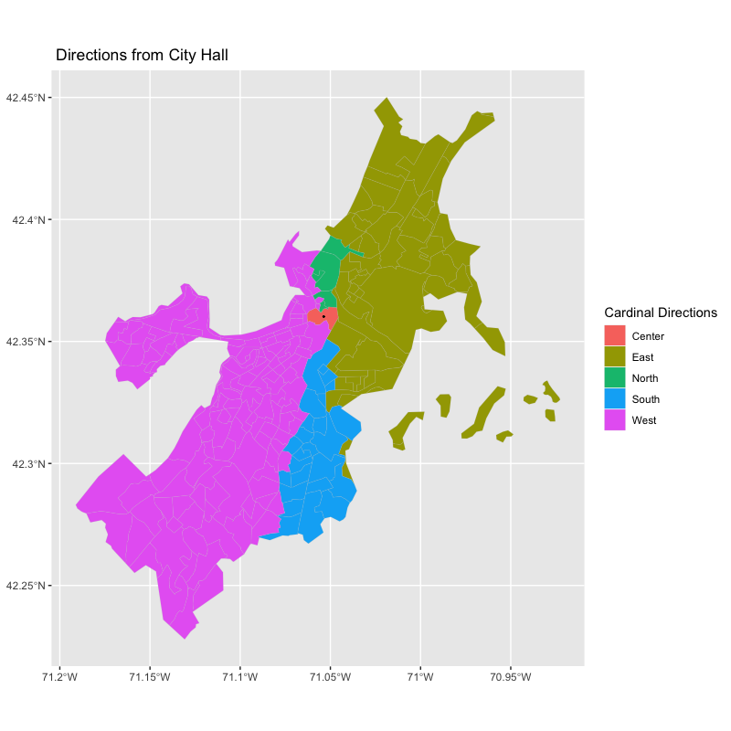
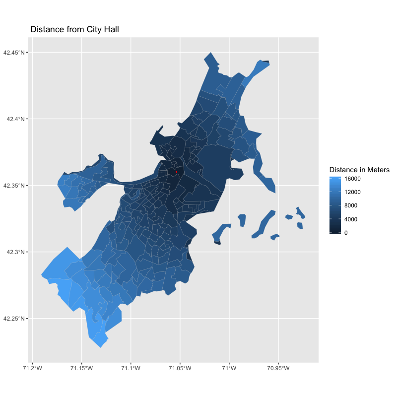
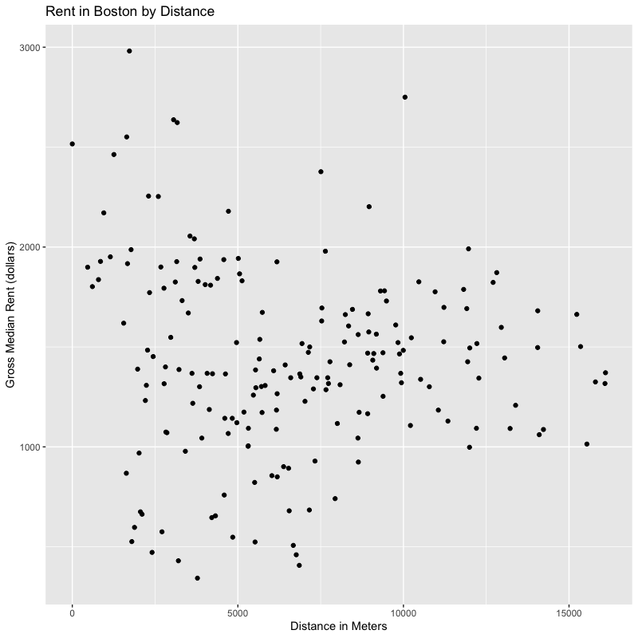

# Final Project

Here is a [link](index.md) back to the home page

# The project

This product uses the Census Bureau Data API but is not endorsed or certified by the Census Bureau.

For my final project I attempted to recreate the [QGIS Direction Model](lab1SQL.md) from the first two labs, except this time in RStudio. Where in the original labs i used model builder(including SQL code) and point-and-click functions in QGIS, this time I used exclusively R code. Something I am particularly proud of (and made my life significantly more difficult) was that I even downloaded the datafiles using R. I have used R before, so many of its basic functions are already familiar to me. Thus, this was mainly an exercise in acquiring data, its manipulation, and exploring new was to present data.

I completed this lab in a cartesian plane due to issues converting any of my data or functions into a CRF. Because it is in a very small geographic area, however, I believe that the variance is minimal. The main reason for this is because having the data as a multipolygon was breaking the functions that allowed for conversion into different coordinate reference systems.

To download my RStudio code, click [here](Final.R)


I used the following libraries in my work.
```
library('tidyverse')
library("tidytext")
library('dplyr')
library("sf")
library("RColorBrewer")
library("ggplot2")
```
## Methods

This provided a list of all the data columns in the acs 5-year.
```
v17 <- load_variables(2017, "acs5", cache = TRUE)
```
This provided the census tracts of Massachusetts with a selected variable.
```
tarr <- get_acs(geography = "tract", variables = "B25064_001",
                state = "MA", geometry = TRUE, key="3d89f005b11bd0cc562da8eea31dc3ce5011a707")
```
The first line below selects just the Boston tracts, and the second selects the tract where city hall is which will be treated as downtown for this exercise.
```
bos <- tarr[grep("Suffolk", tarr$NAME), ]
dt <- bos[grep("Tract 303", bos$NAME), ]
```

This turns each multipolygon into a centroid.
```
cent <- st_centroid(bos$geometry)
Cdt <- st_centroid(dt$geometry)
```

These extract the X,Y coordinates for each centroid into lists.
```
cent1 <- st_coordinates(cent)

cdt1 <- st_coordinates(Cdt)
```

These create data frames out of the coordinate lists.
```
x <- data.frame(lon = cent1[,"Y"],
                lat = cent1[,"X"])


center <- c(lon = cdt1[,"Y"],
            lat = cdt1[,"X"])
```

This function gets the bearing in degrees of each centroid in comparison to the downtown centroid.
```
robbieBear <- function(x, center){
  bear <- NULL
  for(i in 1:nrow(x)){
  bear[i] <- bearing(center, x[i, ])
  }
  return(bear)
}
```

This reattaches the GEOID to act as a unique identifier for the degrees. I then renamed the columns to allow for a join back to my original Boston data.
```
deg1 <- data.frame(robbieBear(x, center), bos$GEOID)
colnames(deg1)[1] <- "direction"
colnames(deg1)[2] <- "GEOID"
jdeg <- left_join(bos,
                    deg1,
                    by = "GEOID")
```

These ifelse() statements separated the degrees into cardinal directions.
```
jdeg1 <- jdeg %>%
  mutate(cardinal = ifelse(direction >= -135 & direction < -45, "South",
                           ifelse(direction == 0, "Center",
                           ifelse(direction >= -45 & direction < 45 & direction != 0, "East",
                                  ifelse(direction >= 45 & direction < 135, "North",
                                         "West")))))
```

This created a separate data frame that was only the downtown datapoint.
```
jdeg2 <-jdeg1%>%
  mutate(center = ifelse(NAME == "Census Tract 303, Suffolk County, Massachusetts",
                         1,0))
```

These create the direction graphs by degrees and cardinal direction.
```
ggplot() +
  geom_sf(data=jdeg1, aes(fill=cardinal), color="grey",lwd = .05)+
  geom_sf(data=Cdt, aes(), lwd = .3) +
  labs(title = " Directions from City Hall",
       fill = "Cardinal Directions")

ggplot() +
  geom_sf(data=jdeg1, aes(fill=direction), color="grey",lwd = .05)+
  geom_point(aes(cdt1[1],cdt1[2], color= "red")) +
  labs(title = " Degrees off of City Hall",
       fill = "Degrees",
       color = "City Hall")
```
Both maps below have a rectangular aspect ratio as opposed to square because geom_sf() only works with coord_sf() which does not have any function to fix the aspect ratio, and none of the other methods such as coord_fixed() work with geom_sf().




This creates a choropleth map of the gross median rent by census tract
```
ggplot() +
  geom_sf(data=bos, aes(fill=cut_number(estimate,5)), color="grey",lwd = .05)+
  geom_sf(data=Cdt, aes(), lwd = .3, color = "red")+
  scale_fill_brewer(palette="GnBu")+
  guides(fill=guide_legend(title="Gross Median Rent"))+
  labs(title = "Boston's Gross Median Rent by Census Tract")+
  theme(plot.title=element_text(hjust=0.5),
        axis.title.x=element_blank(),
        axis.title.y=element_blank())
```


This is an alternative way to make a choropleth map of the rent.
```
plot(jdeg1["estimate"],key.width = .3, key.length=.5, main = "Median Rent by Tract")
```


This creates a polar plot of rent by direction. As mentioned by Professor Holler in class and Professor Lyford in office hours, do not do polar plots if you have any other option. They are simply too tricky, require too much minute detail, and simply fail to work too often to be worth the trouble. As shown by the graph below.
```
jdeg1 %>%
  ggplot() + 
  geom_point(aes(estimate, direction))+
  coord_polar("y", start= 180)+
  labs(title = "Rent by direction",
       subtitle = "The two labels on the side correspond with the first and second rings.",
       x = NULL,
       y = "Median Rent")
```


This function finds the distance between the downtown tract and each other tract.
```
robbieDist <- function(x, center){
  dist <- NULL
  for(i in 1:nrow(x)){
    dist[i] <- sqrt((center[1] - x[1][i, ])^2 + (center[2] - x[2][i, ])^2)
  }
  return(dist)
}
```

This creates a data frame with the distance and a unique identifier.
```
dist1 <- data.frame(robbieDist(x, center), bos$GEOID)
```

This renames the columns for ease of digestion and joining and multiplies the distance which was in degrees by 111,139 which is the conversion rate into meters. The last line of code joins the two data frames.
```
colnames(dist1)[1] <- "distdeg"
colnames(dist1)[2] <- "GEOID"

dist1 <- dist1 %>%
  mutate(meters = distdeg*111139)
  
joined <- left_join(jdist1,
                  dist1,
                  by = "GEOID")
```

This creates a distance plot that affirms the success of the distance function that I created.
```
ggplot() +
  geom_sf(data=joined, aes(fill=meters), color="grey",lwd = .05)+
  geom_sf(data=Cdt, aes(), lwd = .3, color = "red") +
  labs(title = " Distance from City Hall",
       fill = "Distance in Meters")
```


This creates a scatterplot of rent by distance from the downtown.
```
joined %>%
  ggplot(aes(x = meters,
             y = estimate))+
  geom_point()+
  labs(title = "Rent in Boston by Distance",
       x = "Distance in Meters",
       y = "Gross Median Rent (dollars)")
```


### A brief result

In the original lab, I used Massachusetts as my area of study. Because I switched from using counties to analyze a state to using tracts to analyze a city, my graphics look much different. The general trend is that the downtown of Boston is the most expensive, along with a select few other neighborhoods. There are very clearly more and less expensive areas, and it would be interesting to find the G* of the rents in Boston by tract. But heeding the advice from Professor Holler, that is a challenge for another day.

## Conclusion

RStudio is an incredibly adaptable software, able to do everything from data manipulation to statistics to graphics to mapping. The ability to access the spatial analysis and basic cartography parts of that toolset can allow a geographer to easily do more with their data than just spatial analysis. The ease that RStudio allows users to transition between different types of analysis is impressive which in turn can lead to a more complete and thorough analysis of any problem.

RStudio has a robust online user community, making it relatively accessible for a software. Not only that, its in-program documentation is very thorough, meaning that if you know what you are looking for it is generally possible to figure it out yourself. That said, it still is an open source software. While that comes with many benefits, such as amazing customizability, it also often has glitches that make little to no sense. For example:

When creating my center points from the multipolygons, I received the error below.
```
In st_centroid.sfc(dt$geometry) :
  st_centroid does not give correct centroids for longitude/latitude data
```
As I went through the rest of my workflow, however, the results made sense and RStudio was consistently giving me warnings or randomly refusing to execute commands that were working the moment before with no changes (I repeatedly checked, this at least was not user error). Thus, I am inclined to believe that this was yet another incorrect error.

While this was an interesting academic exercise in swapping software to complete the same general workflow, it goes to show what the possibilities of an expansive open source family of programs could do with effective transitions between data types, approaches to problems, and more. 

## Bibliography

First of all, this work would not have gotten done without the help and support of Professor Holler and Professor Lyford. Additionally, many of the functions and experiences that I drew from were founded in my class notes from my data science course. I used them as a springboard for the ?help function and made use of RStudio's extensive internal documentation.

There is a [cheetsheet](ggplot2-cheatsheet-2.1.pdf) published by RStudio that was instrumental to making this project work.

This is a [tidycensus support doc](tidycensus.pdf).

This is a [map of census tracts in Boston](2010-Census-Neighborhoods-Map-by-Census-Tracts.pdf) that I refered to.

Bureau, U. C. (n.d.). Terms of Service. Retrieved December 15, 2019, from The United States Census Bureau website: https://www.census.gov/data/developers/about/terms-of-service.html

Centroid function | R Documentation. (n.d.). Retrieved December 15, 2019, from https://www.rdocumentation.org/packages/geosphere/versions/1.5-10/topics/centroid

Muenchow, R. L., Jakub Nowosad, Jannes. (n.d.). Chapter 2 Geographic data in R | Geocomputation with R. Retrieved from https://geocompr.robinlovelace.net/

How To Easily Customize GGPlot Legend for Great Graphics. (2018, November 13). Retrieved December 15, 2019, from Datanovia website: https://www.datanovia.com/en/blog/ggplot-legend-title-position-and-labels/

How to plot multiple data series in R? – sixhat.net. (n.d.). Retrieved December 15, 2019, from https://www.sixhat.net/plotting-multiple-data-series-in-r.html

Methods to coerce simple features to <code>Spatial*</code> and <code>Spatial*DataFrame</code> objects—As. (n.d.). Retrieved December 15, 2019, from https://r-spatial.github.io/sf/reference/coerce-methods.html

Polar.plot function | R Documentation. (n.d.). Retrieved December 15, 2019, from https://www.rdocumentation.org/packages/plotrix/versions/3.7-7/topics/polar.plot

R sqrt Function. (2016, October 3). Retrieved December 15, 2019, from Tutorial Gateway website: https://www.tutorialgateway.org/r-sqrt-function/

The Complete ggplot2 Tutorial—Part2 | How To Customize ggplot2 (Full R code). (n.d.). Retrieved December 15, 2019, from http://r-statistics.co/Complete-Ggplot2-Tutorial-Part2-Customizing-Theme-With-R-Code.html


Here is a [link](index.md) back to the home page


# The Records

In the spirit of transparency, I have included below the various pre-project planning phases and brainstorming work.

### GIS, statistics, and R- cross platform replicability and transparency

I am interested in exploring how to do many of the actions/topics covered this semester in R. This might include spatial analysis, database management, basic mapping, probability functions, and maybe more. In class we have already begun exploring how to add files to a database using R, but I am still interested in finding ways to push the limit of that knowledge. Related topics that we have covered in class include replicability (how switching software affects the possibility of reenacting work) and how to manage variability in data/representation. One of the greatest possible strengths of R is the capacity to write out the code for an entire problem and then run it, either in pieces or in its entirety. I am interested to see how much it would be reasonable to do in one workflow in R which draws on how we began to use SQL in our work.

Academic resources I might use include:

The chapter on Error evaluation and tracking

Accounting for Spatial Uncertainty in Optimization with Spatial Decision Support Systems

Social vulnerability indices A comparative assessment using uncertainty and sensitivity analysis

Uncertainty Analysis for a Social Vulnerability Index

The main thrust of what I am interested in doing is replicating some of the prcesses that we have done in a different software format.


## Planning Stage

Replicate the first lab in RStudio, and then make it into a shiny app that allows people to play with different data inputs. A stretch goal would be to allow for different geographies.

The main next step that will make this lab challenging is to push ways to pull data directly from the census beaureau to allow for increased possibilities for users. What will make this challenging is fitting it inside a shiny app.

The data is going to come from the US census beaureau. I am going to use the ACS 5-year data because the 2010 census is 9 years out of date at this point. The ACS data has been taken on a rolling basis, and the 5-year dataset uses the last 5 years to statistically describe geographic areas. Important fields will be total population and race populations. To get the geographic boundaries, I am planning to follow a similar workflow to the Sharpie Lab. The column name that I believe I will need for joins will be named id2, although I may have to change some names to make that work. The workflow itself is going to be the same as lab 1, except with the intent to open up the data inputs to the use and to put the result online.

Maybe use the spdebt function? This is not the purpose of the lab, just my interest.
