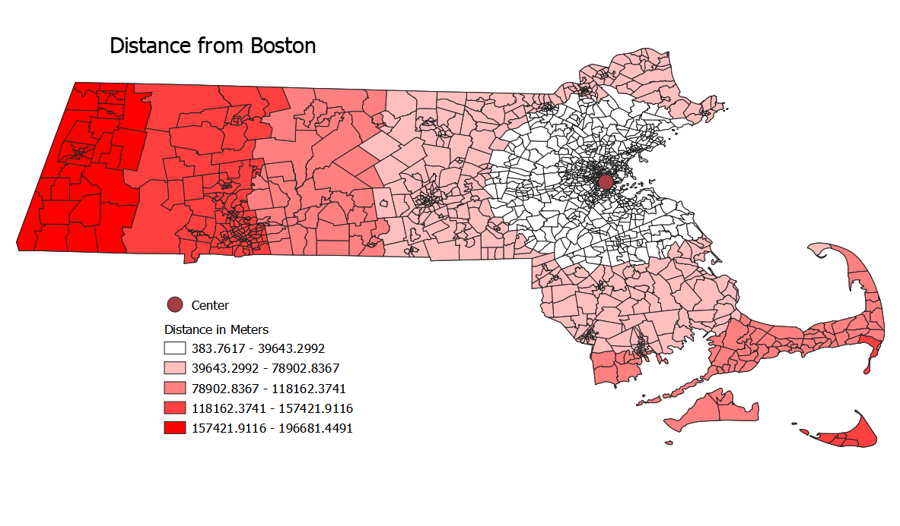
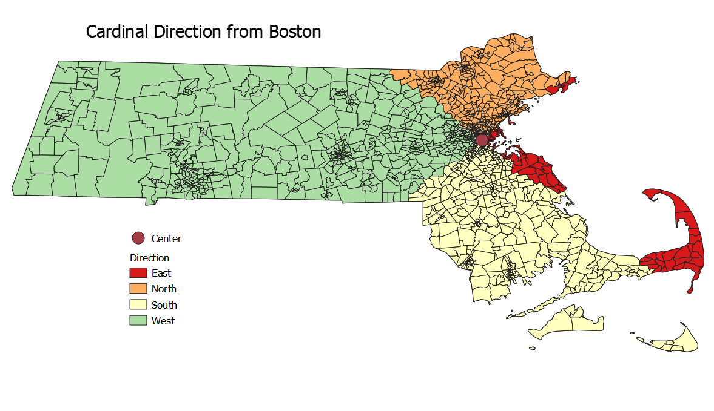

## First and Second Labs: QGIS Modelling

Here is a [link](index.md) back to the home page.

Open source software has never been a more accessible and powerful alternative to proprietary software than it is today. Statistical programs such as R have been mainstreamed and for spatial software, QGIS has an active and growing community of developers and users. There are user and development conferences such as FOSS4G, and robust online communities. The value of open source software such as QGIS comes from its technical flexibility, economic accessibility, and the philosophical ramifications.

The economic ramifications are relatively clear cut. Proprietary software is expensive which makes organizations and individuals with constrained resources unable to access them. This is primarily talked about in terms of the developing world, however there are many organizations within more developed countries that cannot afford software like ArcGIS. Open source provides an alternative. This is slightly paradoxical, however, as open source also tends to require a higher degree of technical knowledge. That is not a hard and fast rule, of course, but does tend to hold true. Once a coder is involved, however, there are many possibilities for the adaptation of open source software to suit the needs of its users. It is an exciting, if imperfect opportunity.

Beyond its practical uses, open source software has opened up new fronts in the debate between GIS as a science and as a tool. While there is a long history of an open source culture in GIS fields [(Sui, 2014)](Sui.pdf), there has been a similarly long history of proprietary dominance which tends to be the first thing that comes to mind for individuals not engages in the open source community. The main GIS developer, ESRI, still controls roughly 90% of the market share but it is less of a hegemonic figure than in the past [(St. Martin and Wing, 2007)](Martin.pdf). The increased freedom associated with open source forms of software development allow for more testing, experimentation, and academic discourse. The transition from free beer to free speech [(Rey 2009)](Rey.pdf) to free as in "libre" has deepened the philosophical discussions around what the limits of open source software actually are. GNU clarifies that into four freedoms, perhaps the most far reaching being the freedom of community engagement- the ability to modify what someone else has done and circulate it for someone else to do the same. Sui (2014) puts forth eight dimensions of open source, ranging from data to hardware to discourse and more. His point is that when practically anyone can be a producer, consumer, and critic of the medium then open source is at its most vibrant. Take to an extreme, there is the valid critique that GIS is a product of its history. It has been made by a select group of developers without public comment in mind [(Sieber, 2004)](Sieber.pdf), and the fundamental program development does not reflect the utmost potential of open source thinking.

That is why I think that open source offerings in academia are incredibly valuable, similarly to St. Martin and Wing. They showcase alternatives to hegemonic technology while also encouraging students to do the best of liberal arts thinking- critique, problem solve, and work collaboratively. The work below is a QGIS model intended to both showcase the uses of a simple spatial model meant to fit a specific need in place of a more generalized tool. Additionally, it showcases how some simple SQL code can be used as alternatives to a point-and-click approach within the user interface. While making these was not easy, it was certainly accessible to anyone with a few hours to problem solve and a willingness to learn.

The most interesting points of the screen captures is that switching to SQL in my model forced me to make the center point in a seperate step, seen in the second screen capture. I literally took the same steps from the main model and moved them over to create an output, but that made all the difference. It showcases the irregularity of software like QGIS. For all their benefits, there are still bugs. The trick is being able to work around them. A second quirk is that the vector layer as an input simply would not work, however a vector feature layer would. These are the sorts of things that it is important to identify, and then figure out a workaround. Someone who knows more code than I could possibly go in and fix it themselves. This connects to the overall issues of open source that I mentioned earlier, however. It lends itself to those with some sort of coding experience, or at least an understanding of what sorts of issues they might confront. It can be a challenging format for beginners.

This is a version of my model that uses some SQL code.

[SQL model version](SQL_Az_Model.model3)

Here is a link to the page containing the non-SQL version of the model.

[First model](qgisModel.md)

And here is a link to the model to build the centroid of Boston. I used select by feature in QGIS and set COUNTYFP to 025 to produce only Boston. Then I ran the model below specifying only selected features.

[Center](MassCent.model3)

This is a map of the distance of any given cencus tract from Boston with a graduated data representation. This legend (and all subsequent ones) were excluded due to the technical challenge of including them.

This map shows the direction of each census tract from the centroid of Boston.

The following two maps are result of census data joined to the Mass shapefile.

This is the median gross rent of all census tracts within Mass.

This map is the total latinx population in each county.

A comparison between the two shows that while housing prices are higher in many urban areas, parts of the Cape, the Berkshires, and the North Shore, Latinx populations are strongly tied to urban areas.

The following two links lead to plots taken from the main model.

Rent by direction
[Polarplot](polar.html)

Latinx population by distance
[Scatterplot](Scat.html)

A note on the relevance of the model to entities larger than cities: While Massachusetts is certainly not a densely packed urban core, it is a small and highly urbanized state. Using the model on it showed interesting relationships between different sized urban areas, allowed for a look into how urban areas and their suburbs relate over rent and Latinx population, and more. Also, Ben Dohan was already doing Boston and I wanted to do something unique.

### My Data

[Mass Shapefile](cb_2018_25_tract_500k.shp)

Here is a [link](index.md) back to the home page
