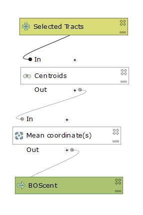
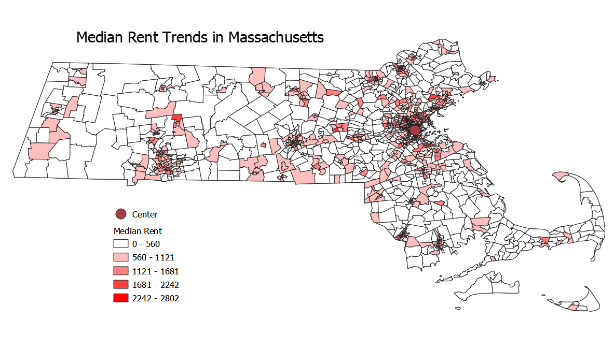

## First and Second Labs: QGIS Modelling

Open source software has never been a more accessable and powerfull alternative to proprietary software. Statistical programs such as R have been mainstreamed and for spatial software, QGIS has an active and growing community of developers and users. There are user and development conferences such as FOSS4G, and robust online communities. The value of open source software such as QGIS comes from its technical flexibility, economic accessability, and the philisophical ramifications.

Open source software has opened up new fronts in the debate between GIS as a science and as a tool. The increased freedom associated with open source forms of software development allow for more testing, experimentation, and academic discourse. The transition from free beer to free speach (Rey 2009) to free as in "libre" has deepened the philisophical discutions around what the limits of open source software actually are. When practically anyone can be a producer, consumer, and critic of the medium then defining such boundaries is difficult to do.

The work below is a model intended to both showcase the uses of a simple spatial model in QGIS and how some simple SQL code can be used as alternatives to a point-and-click approach within the user interface.

This is a version of my model that uses some SQL code.

[SQL model version](SQL_Az_Model.model3)

Here is a link to the page containing the non-SQL version of the model

[First model](qgisModel.md)

This is a map of the distance of any given cencus tract from Boston with a graduated data representation. This legend (and all subsequent ones) were excluded due to the technical challenge of including them.

This map shows the direction of each census tract from the centroid of Boston.

The following two maps are result of census data joined to the Mass shapefile.

This is the median gross rent of all census tracts within Mass.

This map is the total latinx population in each county.

A comparison between the two shows that while housing prices are higher in many urban areas, parts of the Cape, the Berkshires, and the North Shore, Latinx populations are strongly tied to urban areas.

The following two links lead to plots taken from the main model.

Rent by direction
[Polarplot](polar.html)

Latinx population by distance
[Scatterplot](Scat.html)

Here is a [link](index.md) back to the home page
