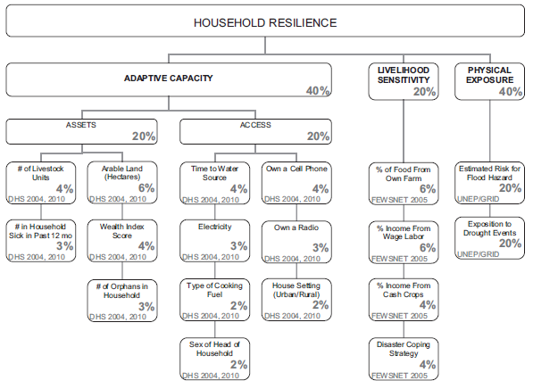
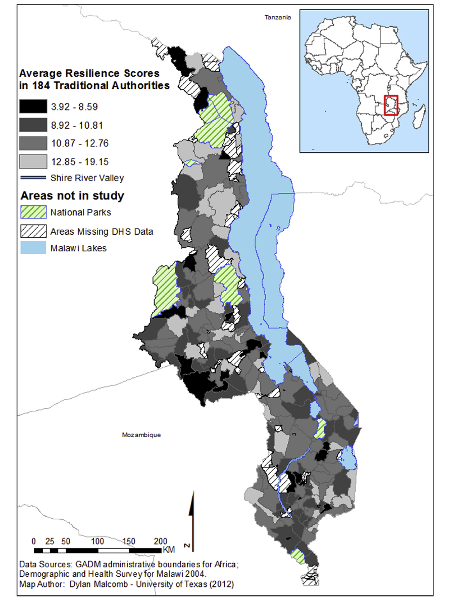
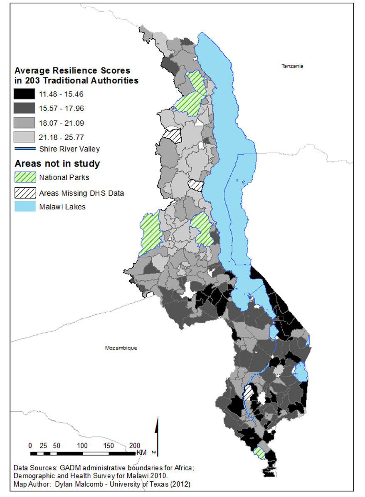
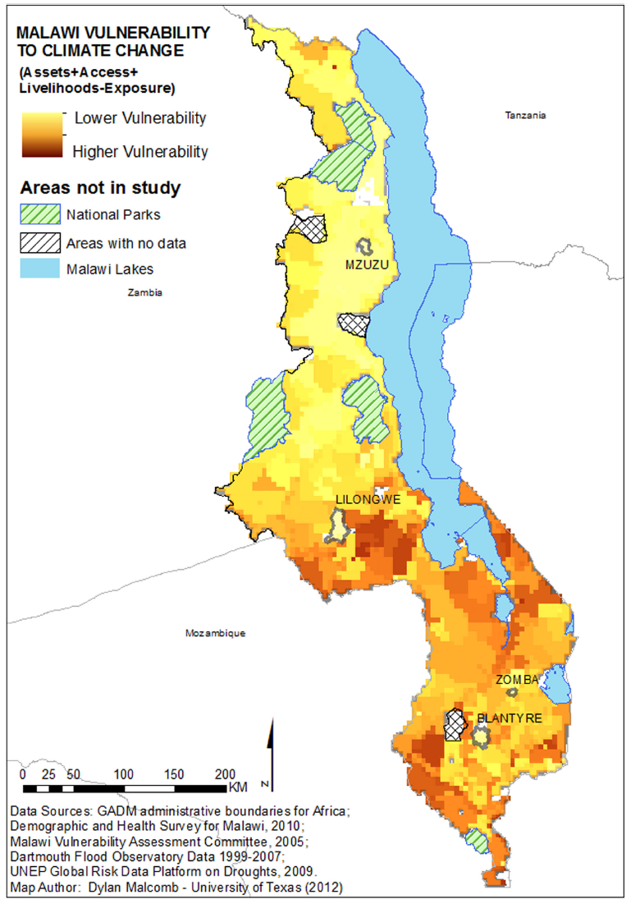
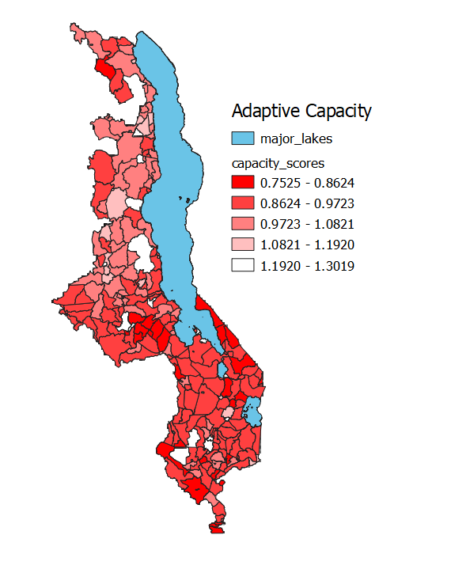
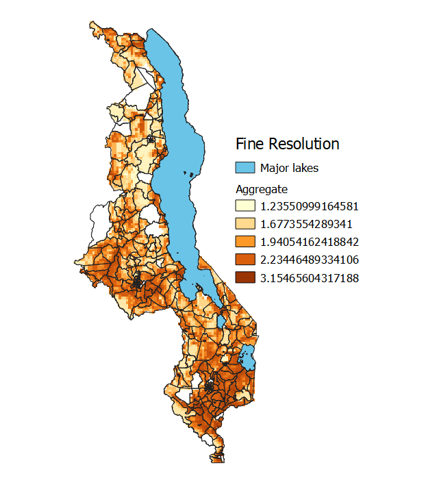
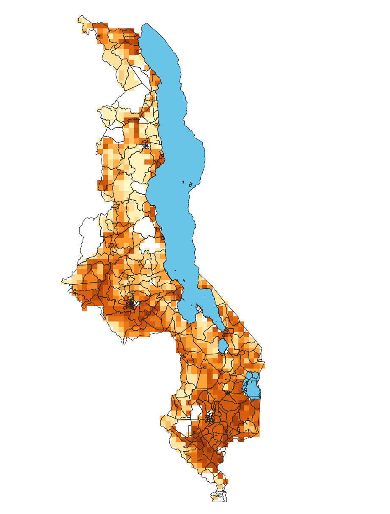
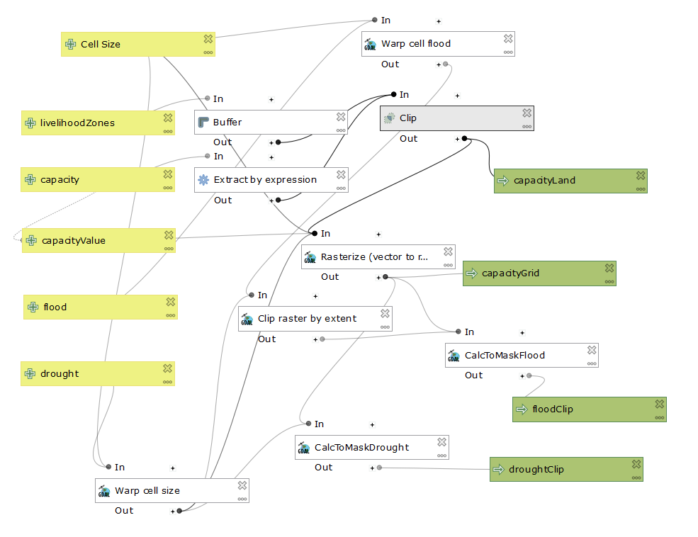

# Reprodicability in Geographic Research; an academic analysis
## Vulnerability modeling for sub-Saharan Africa: An operationalized approach in Malawi
### By Malcomb, Weaver, and Krakowka, 2014

Click [here](index.md) to return to my main page

The goal of this lab project was to replicate the work done by Malcomb et al. for their vulnerability assessment of Malawi. This process began with a close reading of the article to determine their data sources, workflow, and the exact nature of their results. In brief, it was impossible for us to completely achieve any of those objectives. Datafiles came from several sources: FEWS Net showing livelihood sensitivity (20% of the vulnerability model below), the [UNEP GRID Global Risk Data Platform for the flood and drought vulnerability rasters](https://preview.grid.unep.ch/index.php?preview=data&lang=eng) (40% of the model), and the [DHS for community features and vulnerabilities](https://dhsprogram.com/data/Using-Datasets-for-Analysis.cfm) (40% of the model). Professor Holler was unable to track down the FEWS Net dataset, meaning that there was no possibility of true reproducibility even if the other aspects of the lab were faithfully reproduced. Much of the actual working with data was done by Professor Holler due to legal agreements on the use and proliferation of the DHS data on community adaptive capacity, but we were able to look at enough of it to understand what we were using. One other note on that data is that Malcomb et al. used local connections and interviews to understand what the importance of the DHS survey, something that no one else would be able to reproduce unless they had access to all of their notes and interviews- and perhaps not even then. We used R script (available for download at the bottom of this page) to bring the data into our PostGIS databases where we would be able to work with them in QGIS.

 	

These two maps of resiliency are from 2004 and 2010 respectively, but notice that there are different numbers of traditional authorities between the two maps. We do not know what versions of the physical vulnerability data Malcomb used, so we used the most recent data available on UNEP platform which presumably has not changed all too dramatically over the last 15 years (since 2004).

We rated the DHS variables on a scale of 0-5, although in hindsight it seems that Malcomb et al. may have weighed their indicators on a 1-5 scale but did a poor job of communicating exactly what they meant to be doing and where- he said he broke down his data in quintiles but also provided 6 values. Another important point was that these scales were used for each variable, regardless of the type of data contained-discrete or contiguous. Or if they were not, Malcomb neglected to mention that. In our lab we placed them by percentile because that made the most sense, using percent_rank() and ntile() in SQL code. These are other instances where our attempt to replicate the work of Malcomb et al. had to deviate.

Because the goal of Malcomb's research was to create a vulnerability assessment, the importance of the indicator that he creates is very important to the project. As already noted, there are ambiguities about the scale used. For further analysis, we turned to Tate (2012) who performed a comparative assessment on the creation of social vulnerability indices. In the construction of his index, Malcomb was in the 10-20 range of variables that Tate says is indicative of a hierarchical model. He then broke them into sub-indices, such as assets, livelihood sensitivity, and more. He also applied different weights to his sub-indices. In the end, he was working from the top down- having a predetermined idea of what indicators matter and how much as opposed to throwing a wide net for data and variables and then determining what matters (which would have been an inductive approach). 

The drought and flood data came in different sized raster resolutions (0.04166666 vs 0.08333333 decimal degrees for drought and flood respectively), meaning that one of the two datasets had to be converted to the other to allow for analysis. The article's resolution size matches more closely to the fine resolution cells, however, the most accurate (as opposed to precise) of our two maps is the coarse resolution map because data can be aggregated, but not parsed apart in this instance.

This model was our best guess at Malcomb's workflow. While it creates a similar output to his paper, much of his work was a black box so we cannot be sure.

Looking at the workflow of my model, it is possible to input the cellsize of choice, allowing a user to decide what matters to them. The rasterize function allows for all the data to be processed by raster calculator, which creates the final vulnurability output. Our work was done in EPSG:4326, or WGS 84.

This project was interesting because of how applicable the topic of vulnerability and indices are. Professor Holler mentioned that this article was one of the first efforts to create a vulnerability index at the national level. The quality of an index should be determined by its comprehensiveness, clarity, and adaptability- more succinctly, its replicability and reproducibility. 

In a conversation with Professor Peter Kedron of Arizona State University, we went over the importance of both those two concepts. In the end, Malcomb's work was impossible to reproduce without speaking with him. He uses data that is not available to the public that influence his choices on index variables. He uses vague and shifting language for variables and even what sort of flood and drought data he uses- it is impossible to say with absolute confidence that the flood data we used in our lab was the same that he used because he is inconsistent within his writing. This is of critical importance: for an index to be useful, a viewer must be able to understand what went into it to make informed decisions. It should be able to be replicated to make comparisons across space so that the variables to not exist in a vacuum. Malcomb does none of these things, and in the end his work is not particularly useful because it is impossible to frame in any larger conversation because his data, variables, and methods are in a world of their own. 

As geographers, including our data or at least clear documentation for our sources is one of the most important actions we can take to improve the quality of geographic research. A detailed (and accurate) methods section is also critical so that other academics or practitioners can actually understand what went into creating the results. In the spirit of that, below is the code used to make this lab work.

Click [here](vulnerabilitySQL.sql) to download the SQL code created by our class

Click [here](rupload.r) to download the R code used to import data to my database

Click [here](flood.sql) to download the sql code used to convert data into rasters.

Click [here](index.md) to return to my main page

### Citations

Malcomb, D. W., Weaver, E. A., & Krakowka, A. R. (2014). Vulnerability modeling for sub-Saharan Africa: An operationalized approach in Malawi. Applied Geography, 48, 17–30. doi: 10.1016/j.apgeog.2014.01.004

Tate, E. (2012). Social vulnerability indices: a comparative assessment using uncertainty and sensitivity analysis. Natural Hazards, 63(2), 325–347. doi: 10.1007/s11069-012-0152-2
