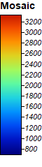
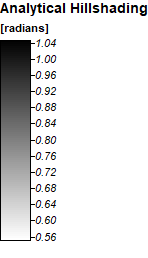
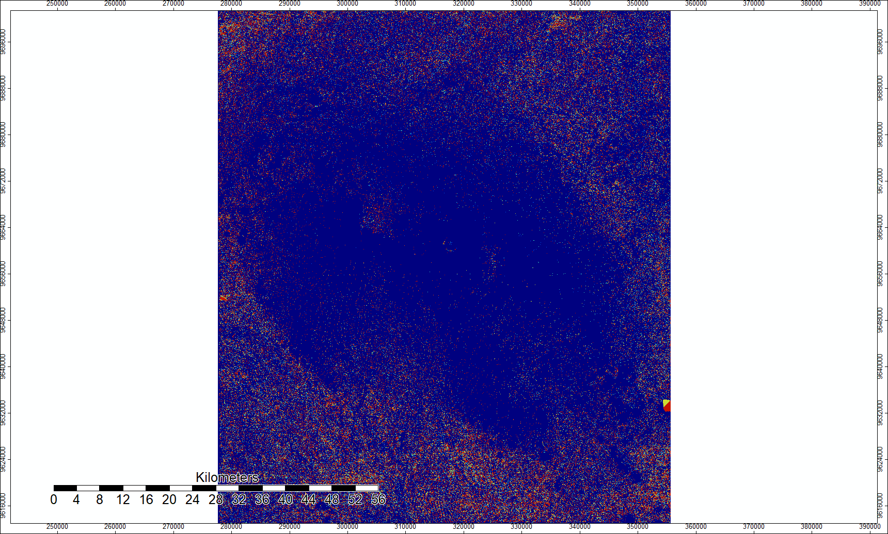

## Lab Three: Global Didital Elevation Models

The following are a series of PNGs to illustrate the workflow of creating and representing a channel network. I used [ASTER Global DEM data](https://search.earthdata.nasa.gov/projects/new?p=C1575726572-LPDAAC_ECS!C1575726572-LPDAAC_ECS&pg[1][v]=t&m=-3.6013183593749996!36.8272705078125!8!1!0!0%2C2&q=ASTGTM%20V003&sb=37.04867545811095%2C-3.3708454262377217%2C37.75108854319018%2C-2.8136057588355214)

Final Result

Mosaiced UTM Projection

Hillshade

Sink Route

Sinks Removed

Flow Accumulation

Channel Network of Points

Channel Description of Points

Here is a [link](index.md) back to the home page
