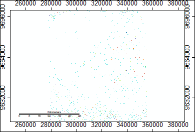
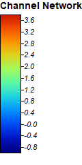

# Lab Three: Global Didital Elevation Models

The following are a series of PNGs to illustrate the workflow of creating and representing a channel network. I used [ASTER Global DEM data](https://search.earthdata.nasa.gov/projects/new?p=C1575726572-LPDAAC_ECS!C1575726572-LPDAAC_ECS&pg[1][v]=t&m=-3.6013183593749996!36.8272705078125!8!1!0!0%2C2&q=ASTGTM%20V003&sb=37.04867545811095%2C-3.3708454262377217%2C37.75108854319018%2C-2.8136057588355214) and the SAGA project version 6.2 to complete this lab.

## Final Result

My final result is a map of channel networks in line form imposed over my analytical hillshading layer to help geographically and topographically situate the channel networks layer.

## Mosaiced ASTER Layers

The data came in two files with different extents, so the first step was to merge them and set the same parameters.

## Mosaiced UTM Projection

The next step was to put the mosaic in the UTM Projection (grid).

## Hillshade

After that I had to create a hillshade layer to visualize elevation and shading.

## Sink Route

This step created a layer which visualizes how water will flow when it encounters a sink in the elevation.

## Sinks Removed

This step corrects for data errors and inconsistancies which would ruin stream flow in the model.

## Flow Accumulation

This step simulates how water will accumulate as it flows, and then how that will influence flows downstream.

## Channel Network of Points

In the final result, this was replaced by a channel network of lines.

## Channel Description of Points

Here is a [link](index.md) back to the home page
