# Lab Three: Global Digital Elevation Models

The following are a series of PNGs to illustrate the workflow of creating and representing a channel network. I used [ASTER Global DEM data](https://search.earthdata.nasa.gov/projects/new?p=C1575726572-LPDAAC_ECS!C1575726572-LPDAAC_ECS&pg[1][v]=t&m=-3.6013183593749996!36.8272705078125!8!1!0!0%2C2&q=ASTGTM%20V003&sb=37.04867545811095%2C-3.3708454262377217%2C37.75108854319018%2C-2.8136057588355214) and the SAGA project version 6.2 to complete this lab.

## Final Result
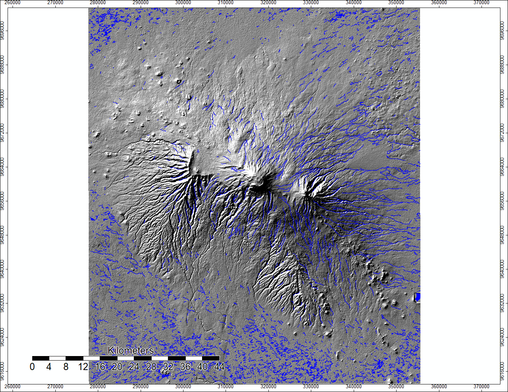

My final result is a map of channel networks in line form imposed over my analytical hillshading layer to help geographically and topographically situate the channel networks layer.

### Data

### Software

[SAGA Webage](http://www.saga-gis.org/en/index.html)
[SAGA tool documentation](http://www.saga-gis.org/saga_tool_doc/6.4.0/)
[SAGA Satellite Image Analysis and Terrain Modelling Manual](SAGA Satellite Image Analysis and Terrain Modelling Manual.pdf)

## Mosaiced ASTER Layers
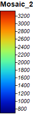

The data came in two files with different extents, so the first step was to merge them and set the same parameters.

## Mosaiced UTM Projection

The next step was to put the mosaic in the UTM Projection (grid).

## Hillshade

After that I had to create a hillshade layer to visualize elevation and shading.

## Sink Route
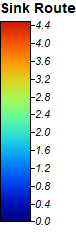

This step created a layer which visualizes how water will flow when it encounters a sink in the elevation.

## Sinks Removed

This step corrects for data errors and inconsistencies which would ruin stream flow in the model.

## Flow Accumulation
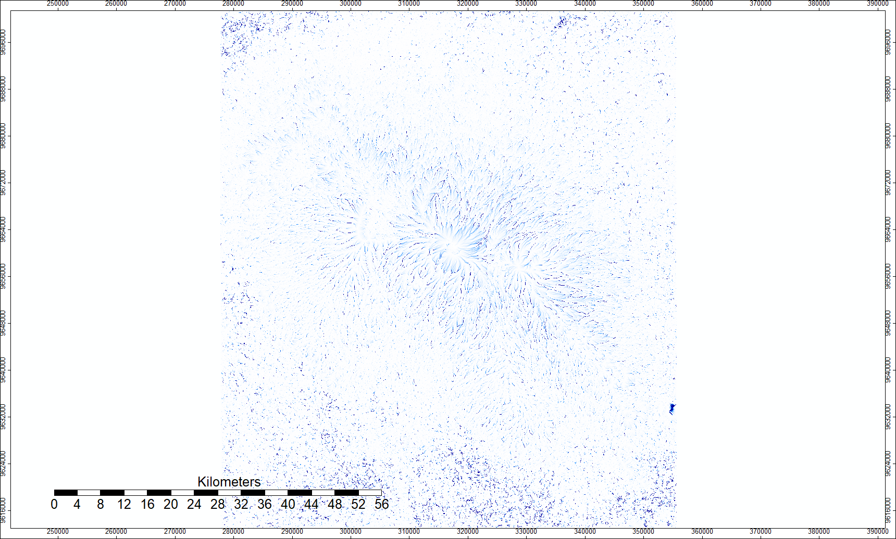

This step simulates how water will accumulate as it flows, and then how that will influence flows downstream.

## Channel Network of Points

In the final result, this was replaced by a channel network of lines.

## Channel Description of Points
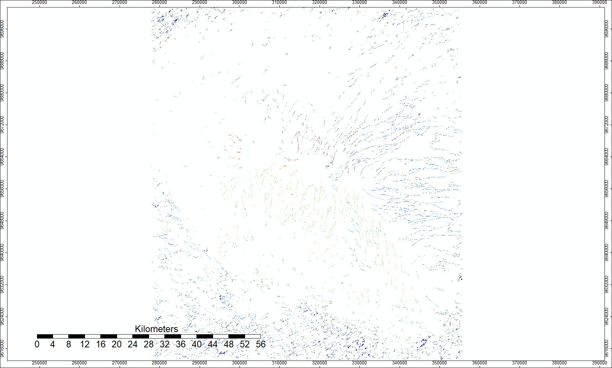

Here is a [link](batch1.md) to the batch processes section of this work

## Lab 3 continued: Batch Processing Flow Accumulation Models

This section took the processes learned in lab three and converted them into batch processes. 

We used SAGA version 6.2, inputting data from ASTER and SRTM. The ASTER data is Model V003, 2019, while the SRTM data is from NASA's Shuttle Radar Topography Mission Global 1 arc second data set.

For the region as a whole, the SRTM data provides a mask for water features while ASTER does not. Furthermore, the channel networks rendered more completely for the SRTM data, i.e. without gaps, than the ASTER data and also appear to more closely fit where streams would be on an elevation model and Google imagery via an eye-check. Additionally, the ASTER Number file has large sections that are drawn from the SRTM data around the summit, and the SRTM data is more complete in that area and generally across the imagery.

ASTER Elevation and Data Sources

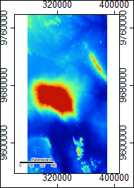

SRTM Elevation and Data Sources

Batch Process Download

[Batch File](mosaic_utmproj.bat)

Bath Process Screen Capture

The batch process is a collection of commands written out in the computer's command window. Instead of needing to go through the UI of SAGA or GQIS, batch processing runs those programs for you directly. Each tool I used to model the hydrology was found [here](http://www.saga-gis.org/saga_tool_doc/6.4.0/a2z.html). Most of my settings remained on default, but later on in the processes some changed. Running the processes one time took roughly twenty minutes, but it was possible to run different batches on several computers to preserve time.

Difference in Elevation

The data is ASTER elevation data subtracted from SRTM elevation data, with orange veering towards ASTER data and blue towards SRTM. Notice there is a diagonal strip running across the frame. I show how a single pass of an imager can dramatically change data outputs.

Flow Accumulation initial image

The image below is what SAGA initially put out as the difference between the flow accumulations from the different data sets. The information was there, but not in workable form.

Flow Accumulation Difference with Contrast

Creating contrast between the two networks was the first step.

This is a closeup of the product of the step prior, allowing viewers to see how the flows are very similar and have many of the same movements, but at the ground level are often slightly different.

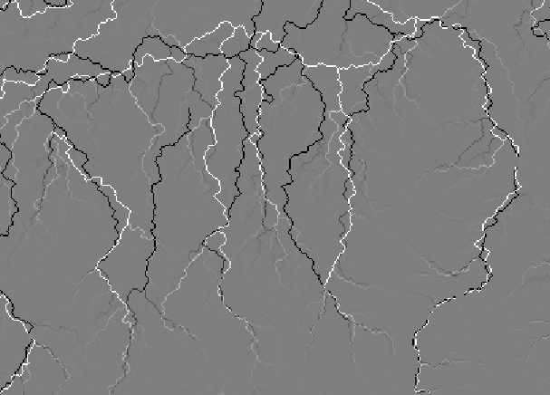

SRTM Hillshade

ASTER Hillshade

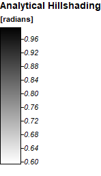

3D Renderings of the channel networks over the hillshade

ASTER

SRTM

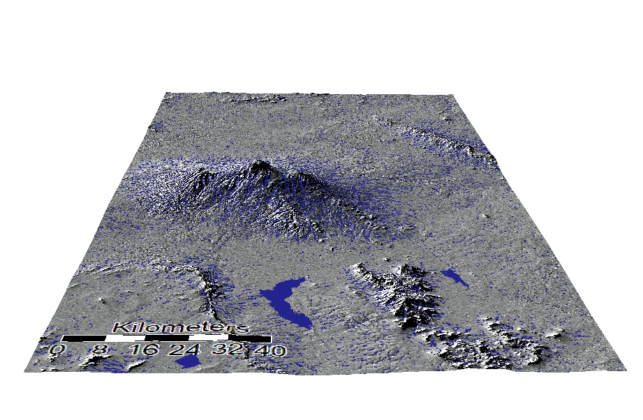

One thing to note between the two different types of data is the water feature in the bottom right hand corner- it is different. SRTM provides a void for known water there, which is more likely to be correct than the ASTER results.

Google Satellite Basemap

While there were errors with this in QGIS, Ben Dohan and Koufre found a good workaround inside of QGIS resulting in the same idea.

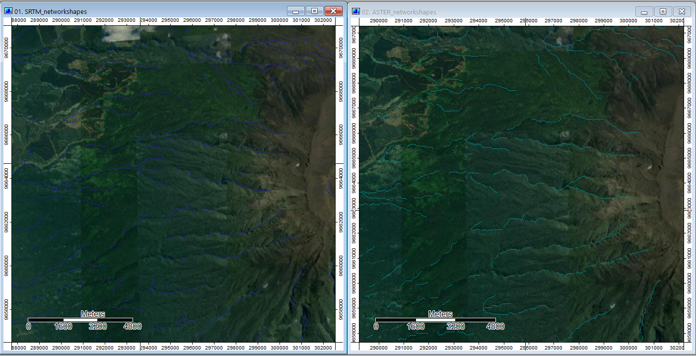

One visual issue is that at higher elevations, the channel networks never seem to leave the ridges of the mountain. However, this is the result of shadows and the angle of photography. In reality the streams really are in the valleys. The flows are not perfect, however, and one method of minimizing error would be to do flow accumulation from the bottom up and then merge the results.

SRTM Error1

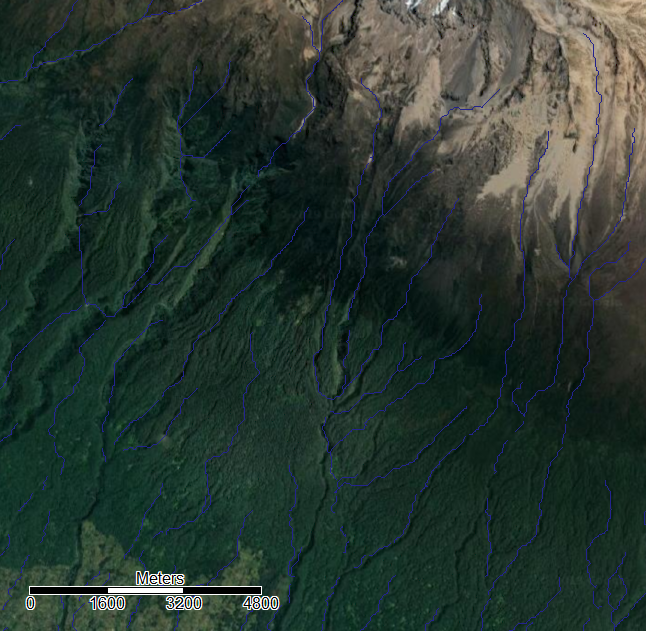

Here, there are examples of the flows mainly following what one would expect from the imagery, but every so often they jump their tracks and go off in an unexpected direction. This seems most likely to be the result of my unit size and sampling method, either having units too broad or too specific to notice the smallest details- or to over react to them. My assumption is the former because of our discussions in class and because having a 30-meter cell size is very large to try and encapsulate most streams.

SRTM Error2

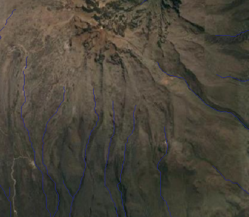

These are examples of where there is what seems like a steep section of the mountain but little differences in terrain to guide it. One likely explanation is that the flow accumulation is based on higher levels of snow and ice at the summit along with higher reflectivity, which is not present in the aerial photography. That exposes an underlying issue with these data sets which we have discussed in class. Because space very often can change over time, having a data set that does not match up squarely with the time frame of other parts of your analysis can create some disjointedness. The ground coverage towards the summit also changes to be more earth and less vegetation, potentially creating more errors for the photography. 

[Click here to go to Hydrology; Lab 3](saga.md)

[Click here to go to the main page](index.md)

Comments from Class 11/25

The large body of water as well as artificially flattened rice patty fields create error in the flow accumulation. If there is a thick enough canopy over a river channel, satellite imagery will not pick up the riverbed. It might even be marked as a ridge as opposed to depression if the trees are localized over the river bed and there is nothing in the surrounding area. At higher elevations and steep mountainsides, there is a chance that the radar angle did not find the most steep crevasses. In the datasets, this lack of data was sometimes fixed with interpolation which covered over the very features I was attempting to find. SRTM uses radar, ASTER uses a combination of photographs- often not very many photographs. For the ASTER data at high elevation, there is often really thick cloud cover that prevents accurate photographs meaning that the elevation is recorded as higher than it actually is.

Here is a [link](index.md) to the home page
