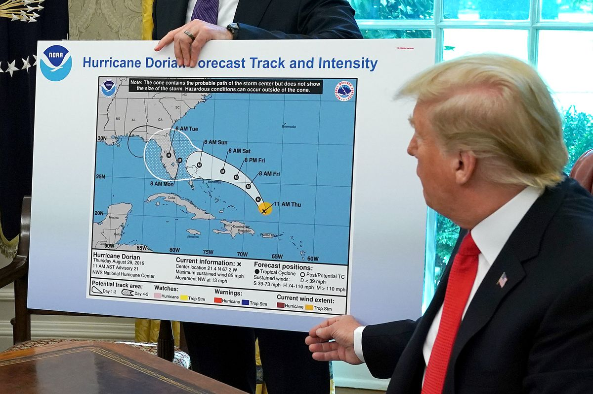
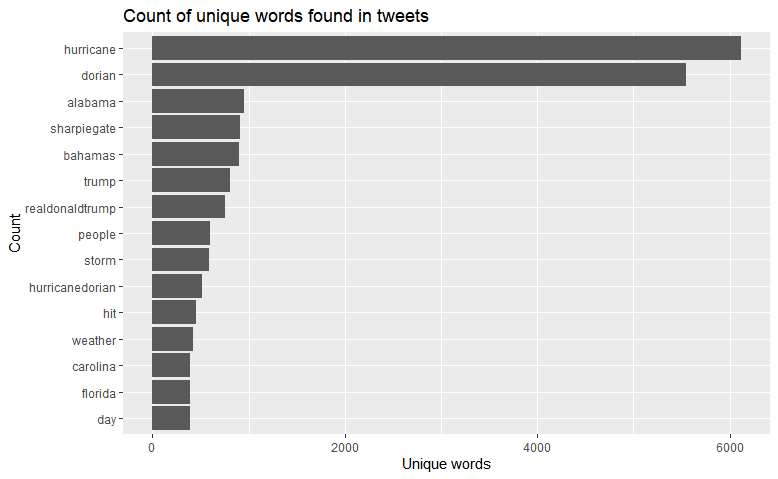
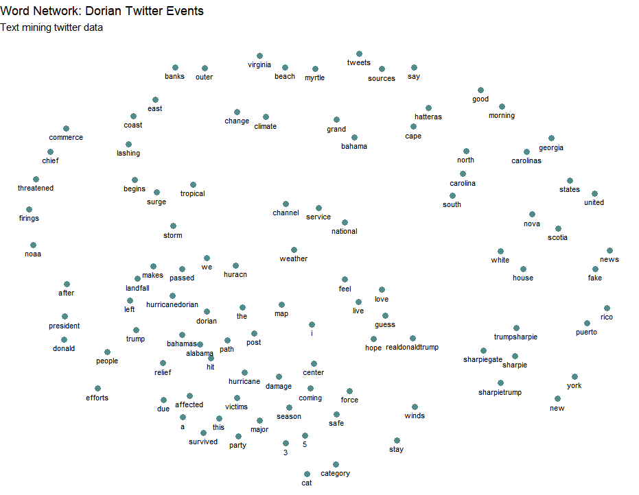
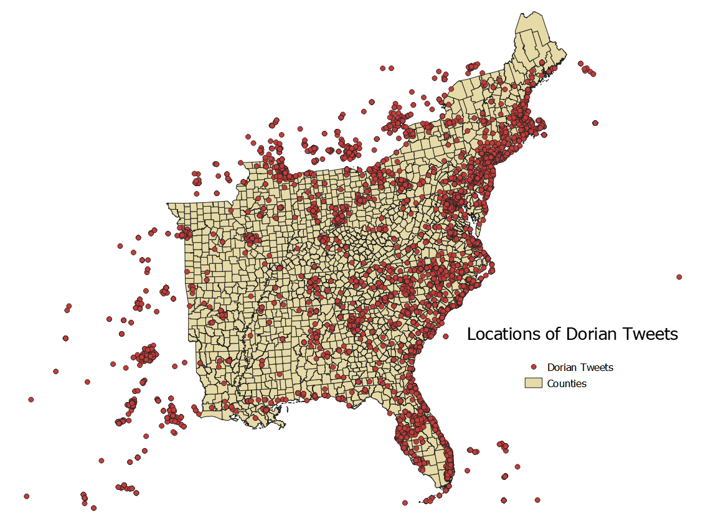
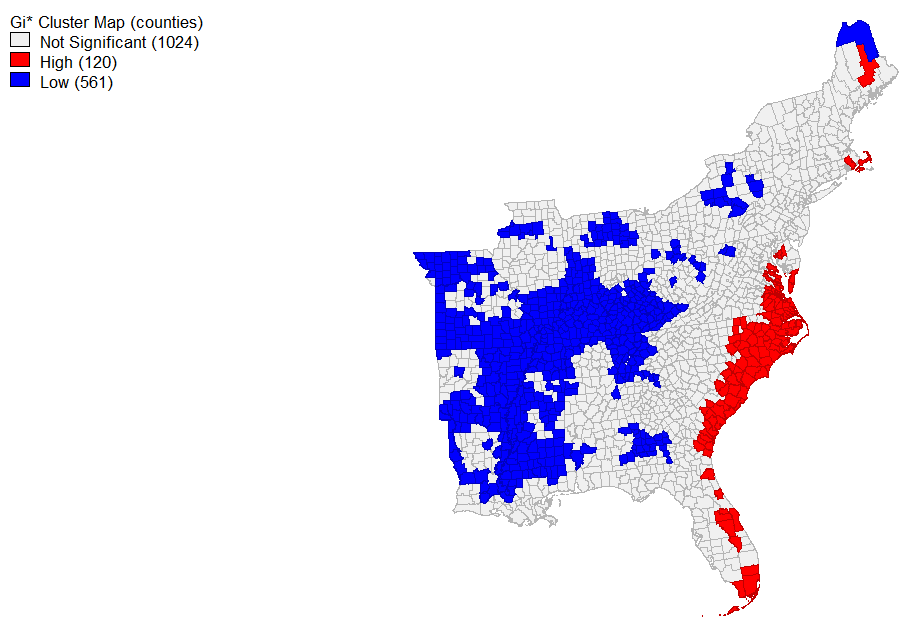
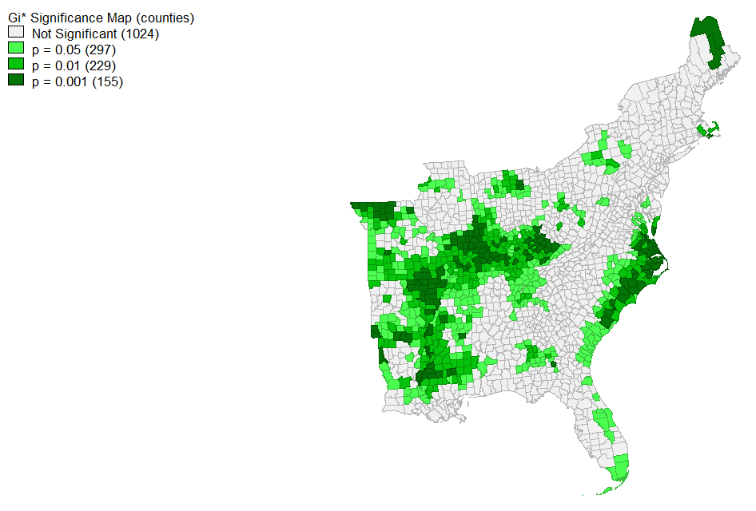
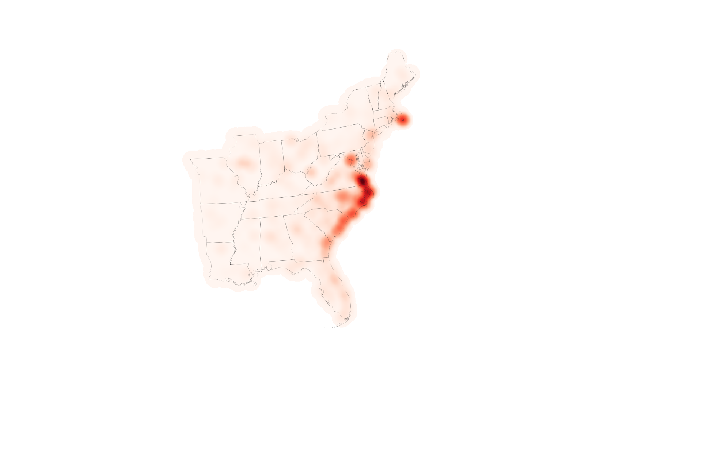

# Twitter and SharpieGate

Click [here](index.md) to return to the main page.

## Introduction

Over the past several years, big data has taken the world by storm. Whether it is 

### Data and code

[Dorian tweet status ids](dorianScrub.csv)

[November tweet status ids](novemberScrub.csv)

[R code for text anaylsis and data creation](twitterForLab.r)

[This SQL code](dorian.sql) was used in PostGIS for QGIS analysis.

### Results

	

 

