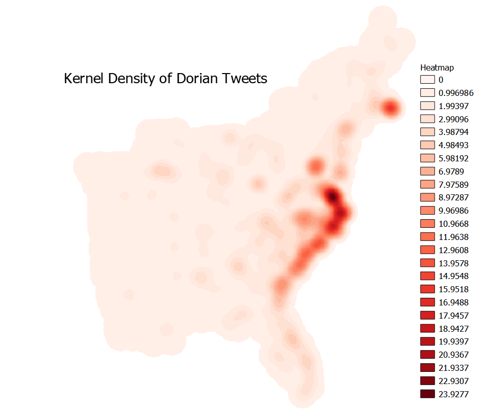

# Twitter and SharpieGate

Click [here](index.md) to return to the main page.

## Introduction

Over the past several years, big data has taken the world by storm. Whether it is to figure out who is doing what and where, how Amazon figures out how to maximize shipping efficiencies, how a police force decides who to target, or how academics try to understand more of human nature, big data is opening up new frontiers in research possibilities.

Twitter is one such popular destination for people looking for big data due to the high volume of tweets created each day. Roughly 1% of Twitter users are location-enabled, enabling geographic analysis with enough tweets.

### Disaster Strikes

One common use of Twitter data has been for disaster analysis, because people often go to social media to express thoughts, needs, or concerns about current events- and few things are more current than a disaster in your area. That is why it was a big deal when President Trump promoted an inaccurate portrayal of hurricane Dorian's path by using a sharpie extension: SharpieGate. The question that we asked, then, was whether or not this misleading image influenced people to tweet about Dorian at disproportionate numbers where Trump said there would be a storm but there was not. This in turn created two questions: Where were people tweeting more about Dorian, if at all, and then what were they tweeting about.


The basis of this lab involved streaming tweets using a Twitter API during the Dorian storm and over a baseline week during the month of November (2019). This was conducted by Professor Holler, who then provided us with the tweet datafiles to use in our analysis. Using both twitter data and US Census shapefiles in RStudio, QGIS, and GeoDa, this was a very open sourced project.

### Data and code

An important note about twitter data is that users are more likely to be technologically competent, younger, and able to afford a mobile or web connected device. When thinking about who is in the most danger from extreme events or other disasters, it is not people who have the means or capacity to act for themselves who are as at risk. This means that it is possible that some of the people who might have the most need to post about disasters are not able to.

On the flip side, data security is an important aspect of all social media work because of the tendency for people to share information about others. Sharing the location of a frail individual during a disaster puts that person more in the public eye- and perhaps more exposed to malicious intent.


[Dorian tweet status ids](dorianScrub.csv)

[November tweet status ids](novemberScrub.csv)

[R code for text analysis and data creation](twitterForLab.r)

[This SQL code](dorian.sql) was used in PostGIS for QGIS analysis.

### Methods

Here is the RStudio code that I used to create the word graphics. The code used to make the data used in these scripts is commented in the SQL download link above.

Unique Word Frequency
```
dorianWords %>%
  count(word, sort = TRUE) %>%
  top_n(15) %>%
  mutate(word = reorder(word, n)) %>%
  ggplot(aes(x = word, y = n)) +
  geom_col() +
  xlab(NULL) +
  coord_flip() +
  labs(x = "Count",
       y = "Unique words",
       title = "Count of unique words found in tweets")
```

Word Network:
```
dorianWordPairs %>%
  filter(n >= 30) %>%
  graph_from_data_frame() %>%
  ggraph(layout = "fr") +
  # geom_edge_link(aes(edge_alpha = n, edge_width = n)) +
  geom_node_point(color = "darkslategray4", size = 3) +
  geom_node_text(aes(label = name), vjust = 1.8, size = 3) +
  labs(title = "Word Network: Dorian Twitter Events",
       subtitle = "Text mining twitter data ",
       x = "", y = "") +
  theme_void()
```

Here is the sql code that I used to connect the tweet data to the counties and to create the tweet ratios.

```sql
--This gives november a geometry.
select addgeometrycolumn('november', 'geom', 102004, 'point',2);
UPDATE november
SET geom = st_transform(st_setsrid(st_makepoint(lng,lat),4326), 102004)

--This changes the geometry to 102004
UPDATE counties
SET geometry = st_transform(geometry,102004);
SELECT populate_geometry_columns('counties'::regclass);

--This deletes the counties in states that were not impacted by Dorian.
DELETE FROM counties
WHERE "STATEFP" NOT IN ('54', '51', '50', '47', '45', '44', '42', '39', '37',
'36', '34', '33', '29', '28', '25', '24', '23', '22', '21', '18', '17',
'13', '12', '11', '10', '09', '05', '01');

--This adds a column for geoid to november.
ALTER TABLE november ADD COLUMN geoid varchar(5);

--This connects each tweet to its county.
update november
set geoid = counties."GEOID"
from counties
where st_intersects(november.geom, counties.geometry)

--This adds a column for geoid to dorian.
ALTER TABLE november ADD COLUMN geoid varchar(5);

--This connects each tweet to its county.
update dorian
set geoid = counties."GEOID"
from counties
where st_intersects(november.geom, counties.geometry)

--This adds a column to Dorian that is its total tweets.
ALTER TABLE dorian ADD COLUMN dortweet integer;
select count(status_id) as dortweet ,geoid
FROM dorian
GROUP BY geoid is not null

--This adds a column to November that is its total tweets.
ALTER TABLE november ADD COLUMN novtweet integer;
select count(status_id) as novtweet, geoid
FROM november
GROUP BY geoid

--This adds a column to my counties that is equal to the total november tweets, separated by county.
ALTER TABLE counties ADD COLUMN novcount integer;
update counties 
set novcount= a
from (select count(status_id) as a, geoid
from november where geoid is not null 
group by geoid) as nc
where counties."GEOID" = nc.geoid

--This adds a column to my counties that is equal to the total november tweets, separated by county.
ALTER TABLE counties ADD COLUMN dorcount integer;
update counties 
set dorcount= a
from (select count(status_id) as a, geoid
from dorian where geoid is not null 
group by geoid) as nc
where counties."GEOID" = nc.geoid

--This normalizes the dorian tweets by population (for every 10,000 people).
ALTER TABLE counties ADD COLUMN normaldor real;
update counties 
set normaldor= dorcount/("POP"/10000)

--This changes null values to 0 in novcount.
update counties 
set novcount = 0
where novcount is null

--This creates the ntdi in counties where there were tweets in either dataset.
ALTER TABLE counties ADD COLUMN ntdi real;
update counties 
set ntdi= (dorcount-novcount)/((dorcount+novcount)*1.0)
where (dorcount+novcount)>0

--Makes ntdi have 0s instead of nulls so there are no null values in the dataset.
update counties 
set ntdi = 0
where ntdi is null
```

### Results


	

 

### Conclusion

What is fascinating about this lab is that anyone with the technological know-how could have developed this problem and executed it. All of the data was available, and as far as open source software goes, RStudio and QGIS are relatively accessible. This brings up the question of what can research look like in this modern age of big data? 

Each individual in this class found and contributed an article to a literature on twitter-based research, and a large proportion of the articles sourced were inductive- i.e. they took data, began working with it, and then figured out what stuck. Twitter has a history of inspiring and enabling such research because of the sheer amount of data available to researchers. From social networks to geographic location to likes to the actual body of the tweet itself and beyond, there is so much data within just a single tweet. Twitter is of course more than a research tool, however. It is only useful for academics because people in society take to the platform to express themselves, share information, have conversations, and more. It is a free flowing conversation. Elwood et al. (2012) describe how volunteered geographic information is changing the academic field of geography and beyond. VGI is not limited to tweets, but can be anything from a geotagged photo to a forum like OpenStreetMap.

Oh- and it is also good to know that a statistically significant amount of people in the places that Trump lied about being in danger were not stupid or blind enough to believe him. This time, at least.


### Citations

Sarah Elwood , Michael F. Goodchild & Daniel Z. Sui (2012) Researching
Volunteered Geographic Information: Spatial Data, Geographic Research, and New Social
Practice, Annals of the Association of American Geographers, 102:3, 571-590, DOI:
10.1080/00045608.2011.595657

Click [here](index.md) to return to the main page.
