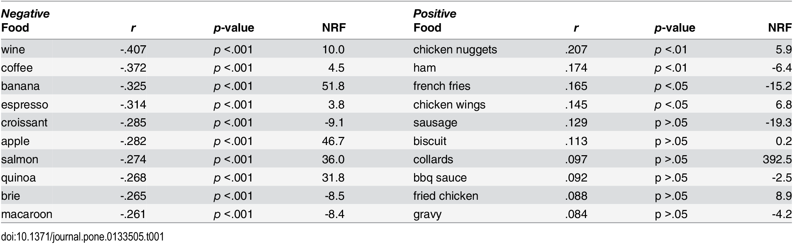

This is an overview of the following academic article.
You Are What You Tweet: Connecting the Geographic Variation in America’s Obesity Rate to Twitter Content

By Ross Joseph Gore, Saikou Diallo, and Jose Padilla

## The purpose of the study was to determine "the relationship among the obesity rate of urban areas and expressions of happiness, diet and physical activity on social media." 

There were four research questions:

### How is the average happiness of the tweets in an urban area related to the population’s obesity rate?

### How is the overall discussion of food consumption on Twitter, and the nutritional density of the food discussed, in related an urban area related to the population’s obesity rate?

### How is the overall discussion of physical activity on Twitter, and the intensity of the activity discussed, in an urban area related to the population’s obesity rate?

### To what extent do the measures used to answer these questions offer unique insight and how well does each correlate with a MSA-level survey measure of a similar variable?

All of those are inductive questions, as opposed to making claims about what the outcomes might be.

## Data Collection and Methods

To collect their data, the researchers used Twitter's streaming API across the calendar years of 2012-2013. They collected a 10% random sample, of which 1.5% was geotaged which is consistent with rates I have seen in other places. This resulted in 25 million geotagged tweets. The MSA (metropolitan statistical area) boundaries were brought in from the US Office of Management and Budget, often as an agglomeration of smaller towns. Obesity rates were drawn from the 2012–2013 Gallup Healthways Wellbeing survey which provided data from the same timeframe as the twitter data.

The researchers scored individual words for their happiness independently by users of Amazon’s Mechanical Turk service, which is a sentiment analysis. This is possible in R using the "tidytext" package, although there are numerous other packages that could provide alternatives.

source of twitter data, including query parameters if known
is the research reproducible? (can you get the same data and produce the same results)
is the research replicable (can you apply it to a new case  and get similar findings/conclusions)?
do the packages/libraries  exist in R to accomplish the research? Search R + Library + keywords of techniques needed

## Happiness Data

"The happiness of a tweet is measured using the Language Assessment by Mechanical Turk (LabMT) word list, assembled by combining the 5,000 most frequent words occurring in each of four text sources: Google Books (English), music lyrics, the New York Times and Twitter. Ten thousand of these individual words have been scored by users of Amazon’s Mechanical Turk service on a scale of 1 (sad) to 9 (happy), resulting in a measure of happiness, h, for each given word [9]. For example, ‘rainbow’ is one of the happiest words in the list with a score of 8.10, while ‘earthquake’ is one of the saddest, with a score of 1.90. Neutral words like ‘the’ or ‘thereof’ tend to score in the middle of the scale, with h(the) = 4.98 and h(thereof) = 5.00 respectively."

## Food Data

"If a tweet contains a word(s) describing at least one food in the USDA National Nutrient Database (USDANDB) [15] it is placed in the Food Tweets set FT; otherwise it is placed in the Non-Food Tweets set NFT." They filtered for the tweets with food, taking the nutrient density of each. They did the same specifically for produce as a subcategory.

While the website claimed that "All relevant data are within the manuscript and its Supporting Information files," that was only partially true. There were some datafiles included on the page, but there was no link to the entire database of tweets or even a breakdown of information for each tweet.

## Physical Activity Data

When "least one physical activity in the guidelines for exercise testing published by the American College of Sports Medicine (ACSM) and the Center for Disease Control and Prevention (CDC)," the tweet was deemed a physical activity tweet.

## Analysis

Their analysis consisted of aggregating tweets by msa, and then creating dot plots with lines of best fit. While simple, this does exactly what they wanted-determines correlative relationships. The authors found that there is an inverse relationship between expressions of happiness in tweets and obesity rates. This could be achieved by using the prop.test() function. 

The authors did not find a statistically significant relationship between the nutrient density of foods in tweets and the corresponding obesity rates. They expressed surprise at this, leading me to think that their research was not as inductive as they let on in their introduction.

These were some of the most commonly appearing positive and negative foods in tweets. They did find, however, that tweets discussing food are more inclined to have a negative relationship with obesity.

When analyzing the relationship between physical tweets and obesity, the authors found a statistically significant negative relationship.

To get a wholistic idea of how these measures might actually quantify happiness, diet, and physical activity, the authors added in other variables to a correlative matrix: (1) obesity rate of a MSA, (2) percentage of individuals in a MSA who report that they eat a healthy diet, (3) percentage of individuals in a MSA who report that they exercise frequently and (4) Well-Being Index of a MSA. They found a positive correlation between every variable except for obesity levels, which were all negative.

Because of the unavailability of the exact tweets, the study is not reproducible. It is mostly replicable, however, although the authors never give a rational for how they manage both twitter places and location-specific tweets.

Follow link to article: [link](https://doi.org/10.1371/journal.pone.0133505)

[Back to main page](index.md)
